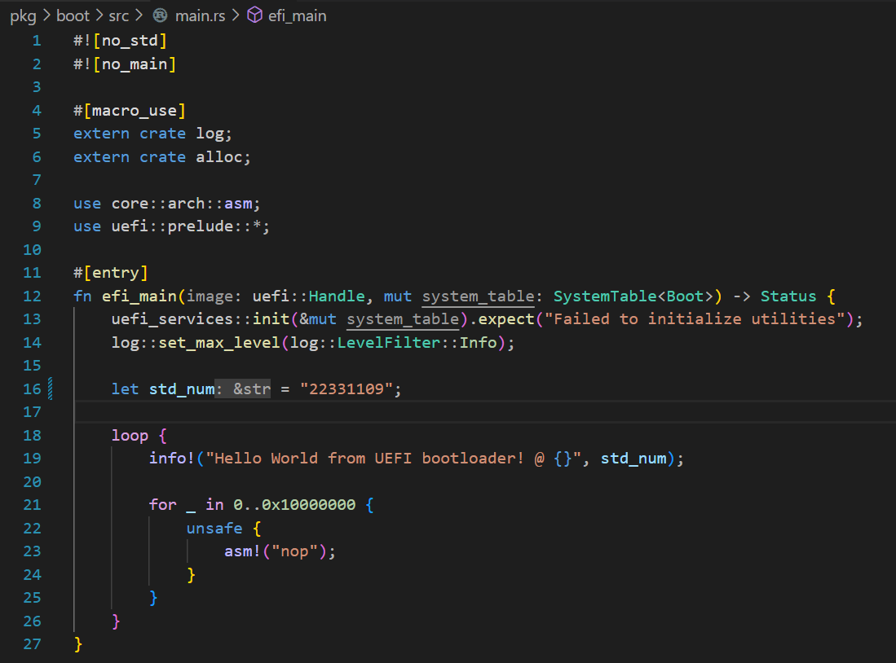
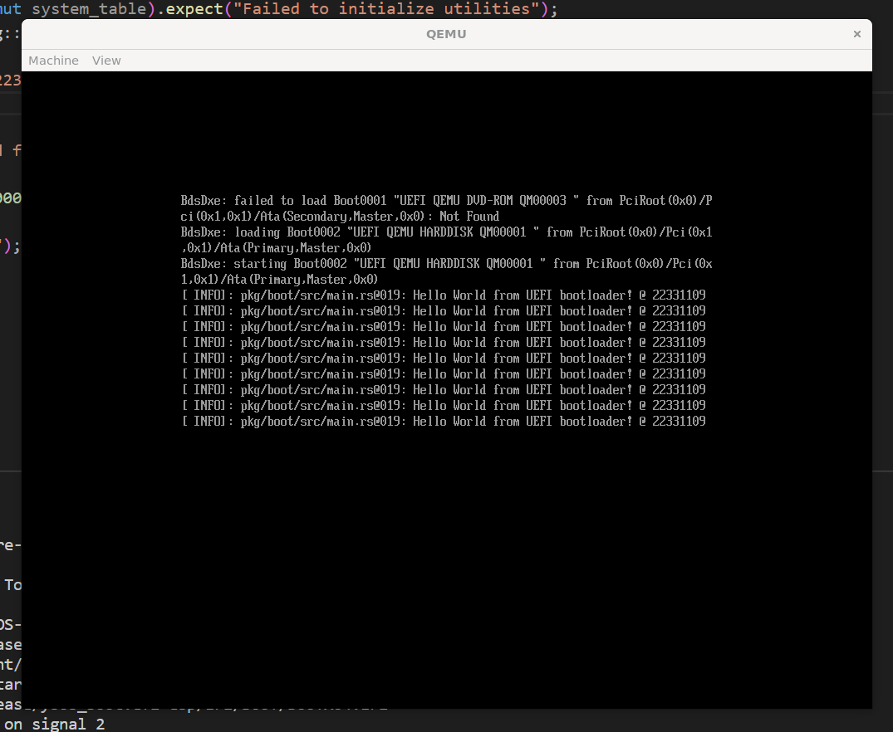

# Lab0 - 环境搭建与实验准备

## 代码说明



<code>efi_main</code> 作为 UEFI 程序的入口函数，efi_main 函数的参数 system_table 包含了 UEFI 程序运行时所需要的各种信息，如内存映射、文件系统、图形界面等。

我们创建一个字符串变量 <code>std_num</code>，将这个参数作为输出的一个参数，然后我们的 EFI 入口函数会循环输出我们的学号信息。



## 思考任务

1. **了解现代操作系统(Windows)的启动过程，UEFI 和 Legacy(BIOS)的区别是什么？**

    **启动流程大致为：**

    - 固件初始化

        在计算机通电时，固件(UEFI或BIOS)会初始化硬件，检测并初始化基本的外部设备，如键盘、显示器和存储设备。

    - 固件自检：

        固件会进行自检，以确保硬件的正常工作。这通常包括检测内存、CPU、外部设备等.

    - 启动设备的选择

        在启动过程中，固件会查找可用的启动设备，如硬盘驱动器、光驱或 USB 闪存驱动器。在 UEFI 系统中，启动设备的选择可以更加灵活，并支持更大容量的硬盘驱动器和更多种类的文件系统。

    - 加载引导程序

        一旦选择了启动设备，固件会加载引导程序(Bootloader)。引导程序的作用是启动操作系统的核心部分。
        
    - 启动操作系统

        引导程序会加载操作系统的核心部分，并启动操作系统。在 Windows 系统中，这通常是 NT Loader(对于早期的 Windows 版本)或 Windows Boot Manager。

    **UEFI 和 Legacy(BIOS)的区别有：**

    - 启动方式

        UEFI 对磁盘和分区的限制更少，因此可以更灵活地管理大容量磁盘和多引导系统。

    - 固件界面

        UEFI 提供了更现代化和交互式的固件界面，允许用户通过鼠标和图形界面进行操作，而传统的Legacy BIOS 通常使用文本界面和键盘操作。

    - 安全性

        UEFI 引入了安全启动(Secure Boot)功能，可以防止未经授权的引导加载程序和操作系统启动。这有助于防止恶意软件在系统启动时进行潜在的攻击。

    - 驱动支持

        UEFI 提供了更多的硬件和设备支持，包括网络堆栈和图形输出。这使得在引导过程中可以更轻松地进行网络引导或显示图形化用户界面。

    - 可扩展性

        UEFI 允许操作系统开发者做扩展性开发，固件具有更多的功能和灵活性，能够更好地适应不断变化的硬件和软件环境。

2. **尝试解释 Makefile 中的命令做了哪些事情？**

    ```
    run: build launch

    launch:
        @qemu-system-x86_64 \
            -bios ${OVMF} \
            -net none \
            $(QEMU_ARGS) \
            $(QEMU_OUTPUT) \
            -drive format=raw,file=fat:rw:${ESP}

    intdbg:
        @qemu-system-x86_64 \
            -bios ${OVMF} \
            -net none \
            $(QEMU_ARGS) \
            $(QEMU_OUTPUT) \
            -drive format=raw,file=fat:rw:${ESP} \
            -no-reboot -d int,cpu_reset

    debug:
        @qemu-system-x86_64 \
            -bios ${OVMF} \
            -net none \
            $(QEMU_ARGS) \
            $(QEMU_OUTPUT) \
            -drive format=raw,file=fat:rw:${ESP} \
            -s -S

    clean:
        @cargo clean

    build: $(ESP)

    $(ESP): $(ESP)/EFI/BOOT/BOOTX64.EFI

    $(ESP)/EFI/BOOT/BOOTX64.EFI: target/x86_64-unknown-uefi/$(MODE)/ysos_boot.efi
        @mkdir -p $(@D)
        cp $< $@

    target/x86_64-unknown-uefi/$(MODE)/ysos_boot.efi: pkg/boot
        cd pkg/boot && cargo build $(BUILD_ARGS)
    ```

    **简单来说 <code>Makefile</code> 做了以下事情：**

    <code>make build</code> 命令编译内核为一个 EFI 文件，并移动到 <code>$(ESP)/EFI/BOOT/BOOTX64.EFI</code> 路径下。

    <code>make launch</code> 则启动 <code>QEMO</code> 并设置固件和 EFI 文件的路径。

3. **利用 cargo 的包管理和 docs.rs 的文档，我们可以很方便的使用第三方库。这些库的源代码在哪里？它们是什么时候被编译的？**

    Cargo 会自动从 crates.io 下载对应的库并构建。

    这些库是在构建项目时被编译的。当你运行 cargo build 或 cargo run 时，Cargo 将检查项目的依赖项，下载并编译需要的库和它们的依赖项。这确保了项目的所有依赖项的版本安全，并且与当前项目兼容。

4. **为什么我们需要使用 #[entry] 而不是直接使用 main 函数作为程序的入口？**

    EFI 引导程序需要满足一些特定的要求，而 main 函数并不是 EFI 引导程序的适当入口点。

    在 EFI 环境中，程序的入口点必须是一个带有特定签名的函数。这个函数通常称为 <code>efi_main</code> 或类似的名称，并且需要返回一个 EFI 状态码。在 Rust 里我们选择 **#[entry]**，作为 EFI 函数的入口点。

## 加分任务

1. **为不同的日志级别输出不同的颜色效果**

    我们使用不同级别的宏(trace!、debug!、info!、warn! 和 error!)来输出不同级别的日志消息。env_logger crate 会根据日志级别为输出的日志消息设置不同的颜色效果。

    ```Rust
    use log::{debug, error, info, trace, warn};
    use env_logger::Env;

    fn main() {
        Env::default().filter_or("MY_LOG_LEVEL=info", "MY_LOG_LEVEL=info");

        env_logger::init();

        trace!("This is a trace message");
        debug!("This is a debug message");
        info!("This is an info message");
        warn!("This is a warning message");
        error!("This is an error message");
    }
    ```

2. **实现一个简单的 shell 程序**

    对于路径切换的处理，Rust 标准库提供了一个方便的方法 `env::set_current_dir` 来改变当前工作目录。

    ```
    use std::env;
    use std::fs;
    use std::io::{self, BufRead};
    use std::path::{Path, PathBuf};

    fn main() {
        loop {
            print!("$ > ");
            io::stdout().flush().unwrap();

            let mut input = String::new();
            io::stdin().read_line(&mut input).unwrap();

            let mut parts = input.trim().split_whitespace();
            if let Some(command) = parts.next() {
                match command {
                    "cd" => {
                        if let Some(dir) = parts.next() {
                            cd(dir);
                        }
                    }
                    "ls" => ls();
                    "cat" => {
                        if let Some(file) = parts.next() {
                            cat(file);
                        }
                    }
                    "exit" => break;
                    _ => println!("Unknown command: {}", command);
                }
            }
        }
    }

    fn cd(dir: &str) {
        if let Err(err) = env::set_current_dir(dir) {
            eprintln!("cd error: {}", err);
        }
    }

    fn ls() {
        let current_dir = env::current_dir().unwrap();
        for entry in fs::read_dir(current_dir).unwrap() {
            if let Ok(entry) = entry {
                println!("{}", entry.path().display());
            }
        }
    }

    fn cat(file: &str) {
        let path = Path::new(file);
        let display = path.display();

        let file = match fs::File::open(&path) {
            Err(why) => panic!("couldn't open {}: {}", display, why),
            Ok(file) => file,
        };

        let reader = io::BufReader::new(file);

        for line in reader.lines() {
            println!("{}", line.unwrap());
        }
    }
    ```

3. **尝试使用线程模型来处理 UniqueId**

    下面的代码演示了 <code>UniqueId</code> 的线程不安全性，将其类型改为 <code>AtomicU16</code> 即可保证线程安全。

    关于 <code>Rust</code> 中的 <code>unsafe</code> 关键字，它被用来标记不安全的代码块或函数。使用 <code>unsafe</code> 关键字标记的代码可能包含以下情况：

    - 解引用裸指针。
    - 调用不安全的函数或方法。
    - 访问或修改可变静态变量。
    - 实现不安全 trait。

    ```
    use std::sync::atomic::{AtomicU16, Ordering};
    use std::thread;

    static mut UNIQUE_ID: u16 = 0;

    fn unsafe_change_unique_id() {
        unsafe {
            UNIQUE_ID += 1;
        }
    }

    fn thread_function() {
        for _ in 0..1000 {
            unsafe_change_unique_id();
        }
    }

    fn main() {
        let handles: Vec<_> = (0..10)
            .map(|_| {
                thread::spawn(|| {
                    thread_function();
                })
            })
            .collect();

        for handle in handles {
            handle.join().unwrap();
        }

        unsafe {
            println!("Final UniqueId: {}", UNIQUE_ID);
        }

        let atomic_id = AtomicU16::new(0);
        let mut handles = vec![];

        for _ in 0..10 {
            let handle = thread::spawn(move || {
                for _ in 0..1000 {
                    atomic_id.fetch_add(1, Ordering::SeqCst);
                }
            });
            handles.push(handle);
        }

        for handle in handles {
            handle.join().unwrap();
        }

        println!("Final Atomic UniqueId: {}", atomic_id.load(Ordering::SeqCst));
    }
    ```