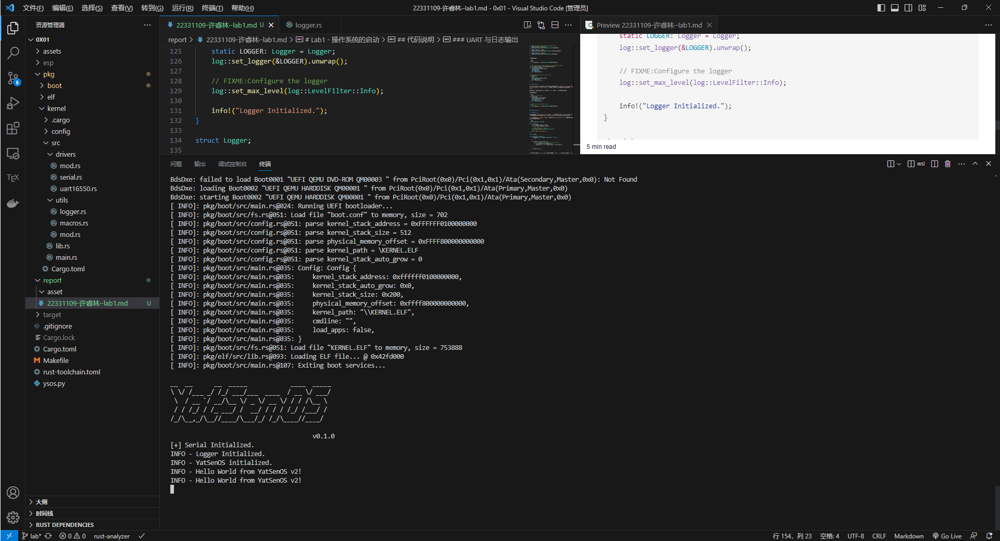
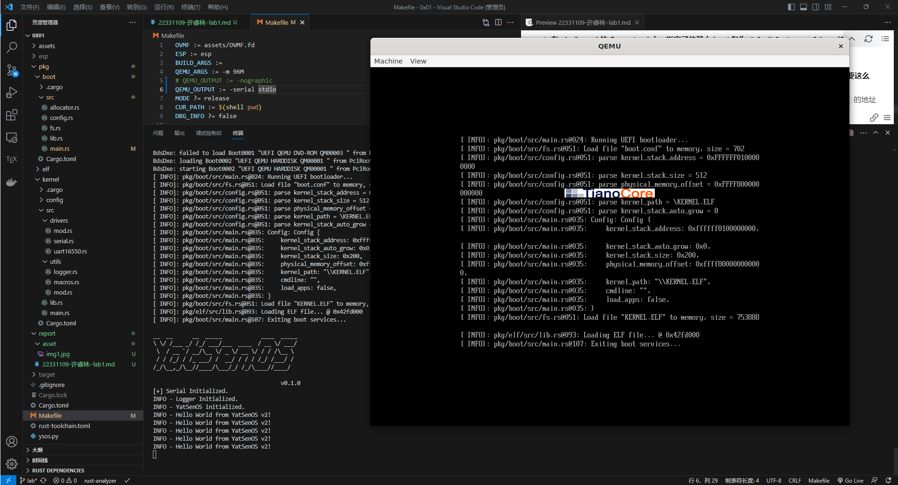
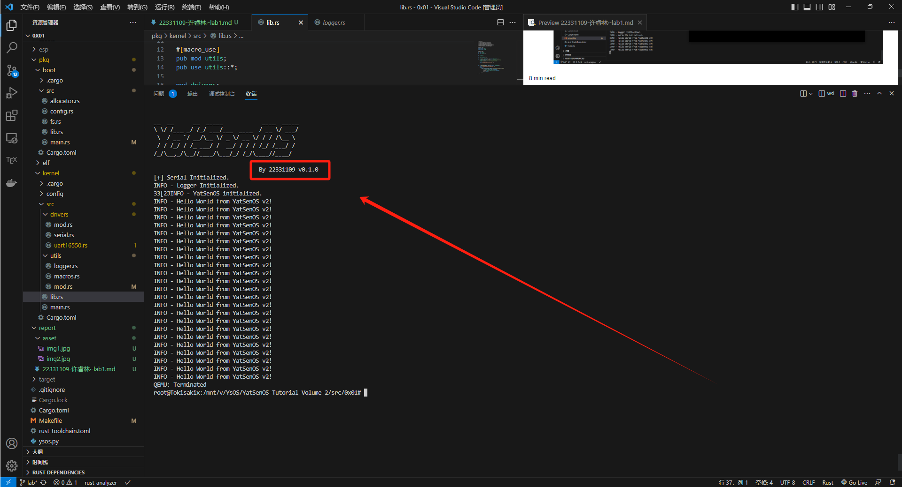

# Lab1 - 操作系统的启动

## 代码说明

### 在 UEFI 中启动内核

1. **加载 Config 文件**

首先需要加载 Config 文件，这个文件的路径为 `\EFI\BOOT\boot.conf`，这里使用 Rust 内置的文件操作来读取文件，具体的操作可以用 `ysos_boot::open_file(bs, CONFIG_PATH)` 和 `ysos_boot:: load_file(bs, &mut file)` 函数来完成。读取文件后将文件数据从 `&mut [u8]` 转换到 `Config<_>` 即可。

关键代码如下：

```Rust
// 1. FIXME:Load config
let config = {
    let mut file = open_file(bs, CONFIG_PATH);
    let buf = load_file(bs, &mut file);
    config::Config::parse(buf)
};
```

2. **加载 EFI 文件**

这里的操作跟上文类似，同样使用文件读取的函数，读取文件后将文件数据从 `&mut [u8]` 转换到 `EFIfile<_>` 即可。

关键代码如下：

```Rust
// 2. FIXME:Load ELF files
let elf = {
    let ElF_PATH = config.kernel_path;
    let mut file = open_file(bs, ElF_PATH);
    let buf = load_file(bs, &mut file);
    xmas_elf::ElfFile::new(buf)
}.unwrap();
```

3. **映射内核文件**

这部分需要先修改 `Cr0` 寄存器来禁用根页表的写保护，以便进行后续的内存映射操作。

接着需要将内核的代码段、数据段、BSS 段等映射到虚拟地址空间中。这里我使用了 `elf::map_physical_memory(offset, max_addr, page_table, frame_allocator)` 函数，这可以将 [0, max_addr) 区间的物理地址映射到 [offset, offset + max_addr) 的虚拟地址。

最后需要将 `ELFfile` 文件中各个 `segement` 加载到对应虚拟地址的内存中，并根据对应段设置对应页表的相关权限，此处的我使用的权限设置逻辑如下：

- 如果此 `segement` 是可执行的，对应页表移除 `PageTableFlags::NO_EXECUTE` 标志。
- 如果此 `segement` 是可读的，对应页表增加 `PageTableFlags::USER_ACCESSIBLE` 标志。
- 如果此 `segement` 是可写的，对应页表增加 `PageTableFlags::WRITABLE` 标志。

`load_segment` 函数关键代码如下：

```Rust
// FISME:handle page table flags with segment flags
if segment.flags().is_execute(){
    page_table_flags.remove(PageTableFlags::NO_EXECUTE);
}
if segment.flags().is_read(){
    page_table_flags.insert(PageTableFlags::USER_ACCESSIBLE);
}
if segment.flags().is_write(){
    page_table_flags.insert(PageTableFlags::WRITABLE);
}
```

关键代码如下：

```Rust
unsafe{
    Cr0::update(|f| f.remove(Cr0Flags::WRITE_PROTECT))
}

// FIXME:map physical memory to specific virtual address offset
let mut frame_allocator = UEFIFrameAllocator(bs);
elf::map_physical_memory(
    config.physical_memory_offset,
    max_phys_addr,
    &mut page_table,
    &mut frame_allocator,
);

// FIXME:load and map the kernel elf file
elf::load_elf(
    &elf,
    config.physical_memory_offset,
    &mut page_table,
    &mut frame_allocator,
);
```

4. **分配内核**

接着需要为内核分配对应的内核栈，并设置相关的权限。这里我使用了 `elf::map_range(addr, count, page_table, frame_allocator)` 函数来为内核栈分配对应的页表，并设置权限为 `R/W`。

最后将修改过的控制寄存器恢复原样，修改 `Cr0` 寄存器开启根页表的写保护。

关键代码如下：

```Rust
// FIXME:map kernel stack
elf::map_range(
    config.kernel_stack_address, 
    config.kernel_stack_size, 
    &mut page_table,
    &mut frame_allocator,
);

// FIXME:recover write protect (Cr0)
unsafe{
    Cr0::update(|f| f.insert(Cr0Flags::WRITE_PROTECT))
}
```

### UART 与日志输出

1. **日志输出**

这里需要补充 `pkg/kernel/src/utils/logger.rs` 里的代码，涉及到 `Logger` 的初始化和输出的实现。这部分我参考了[这篇博客](https://course.rs/logs/log.html)里的做法。

`log` 还提供了 `set_logger` 函数用于设置日志库，`set_max_level` 用于设置最大日志级别，这里的关键代码如下：

```Rust
use log::{Metadata, Record};

pub fn init() {
    static LOGGER: Logger = Logger;
    log::set_logger(&LOGGER).unwrap();

    // FIXME:Configure the logger
    log::set_max_level(log::LevelFilter::Info);

    info!("Logger Initialized.");
}

struct Logger;

impl log::Log for Logger {
    fn enabled(&self, _metadata: &Metadata) -> bool {
        true
    }

    fn log(&self, record: &Record) {
        // FIXME:Implement the logger with serial output
        if self.enabled(record.metadata()) {
            println!("{} - {}", record.level(), record.args());
        }
    }

    fn flush(&self) {}
}
```

经过调试后，最后我们启动 `YsOS`，发现内核成功在 `UEFI` 中加载，并且相关的输出也通过 `UART` 输出至控制台。



## 思考任务

1. **在 pkg/kernel 的 Cargo.toml 中，指定了依赖中 boot 包为 default-features = false，这是为了避免什么问题？请结合 pkg/boot 的 Cargo.toml 谈谈你的理解。**

    操作系统是在裸机上运行，此处设置可以避免链接 Rust 的标准库。

2. **在 pkg/boot/src/main.rs 中参考相关代码，聊聊 max_phys_addr 是如何计算的，为什么要这么做？**

    首先计算各段需要的最大物理地址，最后与 `0x1_0000_0000` 取最大值。这个 `0x1_0000_0000` 的地址与 **IOAPIC**、**MMIO** 机制有关。

    IOAPIC 用于管理和分配中断信号给计算机系统中的各种设备。
    
    MMIO 允许将I/O设备映射到计算机的内存地址空间中，从而使CPU能够通过内存读写指令来与这些设备进行通信。

    这两个机制可以更好地配置中断、控制中断分发以及响应来自外部设备的中断请求等操作，比传统的 I/O 端口方式更灵活和高效，适用于需要高性能中断处理的系统环境。

3. **串口驱动是在进入内核后启用的，那么在进入内核之前，显示的内容是如何输出的？**

    使用UEFI提供的串口输出功能。即使在进入操作系统内核之前，UEFI固件也可以通过串口与外部设备通信，输出启动过程中的信息。这些信息可能包括启动日志、硬件检测结果、启动选项等。

4. **在 QEMU 中，我们通过指定 -nographic 参数来禁用图形界面，这样 QEMU 会默认将串口输出重定向到主机的标准输出。如何定向至主机的标准输入输出？**

    将 `QEMU_OUTPUT` 的值修改为 `-serial stdio` 即可

    

## 加分任务

1. **线控寄存器的每一比特都有特定的含义，尝试使用 bitflags 宏来定义这些标志位，并在 uart16550 驱动中使用它们。**

    考虑如下代码，使用 `bitflag` 来管理线控寄存器的值，分别用 `IS_FULL` 和 `IS_EMPTY` 来表示。

    ```Rust
    bitflags! {
        struct LineStFlags: u8 {
            const IS_FULL = 1;
            const IS_EMPTY = 1 << 5;
        }
    }
    ```

    于是我们便可以使用 `self.line_sts().contains(LineStsFlags::OUTPUT_EMPTY))`、`insert()` 或 `remove()` 函数来便捷设置线控寄存器的值。

2. **尝试在进入内核并初始化串口驱动后，使用 escape sequence 来清屏，并编辑 get_ascii_header() 中的字符串常量，输出你的学号信息。**

    可以清屏并输出学号。

    

3. **尝试添加字符串型启动配置变量 log_level，并修改 logger 的初始化函数，使得内核能够根据启动参数进行日志输出。**

    修改 `Makefile` 中 `DBG_INFO ?= false` 的值为 `DBG_INFO := info`。

    修改 `logger` 里的 `log()` 函数，依据当前日志的等级输出日志信息。

    ```Rust
    impl log::Log for Logger {
        fn log(&self, record: &Record) {
            // Implement the logger with serial output
            if self.enabled(record.metadata()) {
                println!("{} - {}", record.level(), record.args());
            }
        }
    }
    ```

4. **尝试使用调试器，在内核初始化之后（ysos::init 调用结束后）下断点，查看、记录并解释如下的信息：**

    我使用了 `gdb` 和 `objdump` 调试器，记录如下：

    ```
    esp/KERNEL.ELF:     file format elf64-x86-64

    Sections:
    Idx Name          Size      VMA               LMA               File off  Algn
    0 .dynsym       00006fa8  ffffff0000000000  ffffff0000000000  00001000  2**3
                    CONTENTS, ALLOC, LOAD, READONLY, DATA
    1 .gnu.hash     00001f4c  ffffff0000006fa8  ffffff0000006fa8  00007fa8  2**3
                    CONTENTS, ALLOC, LOAD, READONLY, DATA
    2 .hash         00002540  ffffff0000008ef4  ffffff0000008ef4  00009ef4  2**2
                    CONTENTS, ALLOC, LOAD, READONLY, DATA
    3 .dynstr       0001dd6a  ffffff000000b434  ffffff000000b434  0000c434  2**0
                    CONTENTS, ALLOC, LOAD, READONLY, DATA
    4 .rodata       000126b2  ffffff000002a000  ffffff000002a000  0002b000  2**4
                    CONTENTS, ALLOC, LOAD, READONLY, DATA
    5 .eh_frame_hdr 0000000c  ffffff000003c6b4  ffffff000003c6b4  0003d6b4  2**2
                    CONTENTS, ALLOC, LOAD, READONLY, DATA
    6 .eh_frame     0000001c  ffffff000003c6c0  ffffff000003c6c0  0003d6c0  2**3
                    CONTENTS, ALLOC, LOAD, READONLY, DATA
    7 .text         0003ba35  ffffff000003d000  ffffff000003d000  0003e000  2**4
                    CONTENTS, ALLOC, LOAD, READONLY, CODE
    8 .data         00005fd8  ffffff0000079000  ffffff0000079000  0007a000  2**3
                    CONTENTS, ALLOC, LOAD, DATA
    9 .got          000000d0  ffffff000007f000  ffffff000007f000  00080000  2**3
                    CONTENTS, ALLOC, LOAD, DATA
    10 .dynamic      00000080  ffffff000007f0d0  ffffff000007f0d0  000800d0  2**3
                    CONTENTS, ALLOC, LOAD, DATA
    11 .bss          00000028  ffffff0000080000  ffffff0000080000  00081000  2**3
                    ALLOC
    12 .comment      00000048  0000000000000000  0000000000000000  00081000  2**0
                    CONTENTS, READONLY
    ```

    ```
    Breakpoint 1, core::sync::atomic::atomic_load<u8> (order=core::sync::atomic::Ordering::Acquire, dst=<optimized out>) at /root/.rustup/toolchains/nightly-x86_64-unknown-linux-gnu/lib/rustlib/src/rust/library/core/src/sync/atomic.rs:3289
    3289                Acquire => intrinsics::atomic_load_acquire(dst),
    (gdb) info r
    rax            0xffffff000003d0b0  -1099511377744
    rbx            0x5f0df78           99671928
    rcx            0x5f0dfd0           99672016
    rdx            0xffffff01001ffff8  -1095214563336
    rsi            0x5f0dfd0           99672016
    rdi            0x5f0dfd0           99672016
    rbp            0x0                 0x0
    rsp            0xffffff01001fff08  0xffffff01001fff08
    r8             0x0                 0
    r9             0x501               1281
    r10            0x5ae8860           95324256
    r11            0x858               2136
    r12            0xffffffff1ffaffc0  -3758424128
    r13            0x4e7abe0           82291680
    r14            0x5f0df70           99671920
    r15            0x43c8068           71073896
    rip            0xffffff000003d927  0xffffff000003d927 <ysos_kernel::init+7>
    eflags         0x92                [ IOPL=0 SF AF ]
    cs             0x38                56
    ss             0x30                48
    ds             0x30                48
    es             0x30                48
    fs             0x30                48
    gs             0x30                48
    fs_base        0x0                 0
    gs_base        0x0                 0
    k_gs_base      0x0                 0
    cr0            0x80010033          [ PG WP NE ET MP PE ]
    cr2            0x0                 0
    cr3            0x5c01000           [ PDBR=23553 PCID=0 ]
    cr4            0x668               [ OSXMMEXCPT OSFXSR MCE PAE DE ]
    cr8            0x0                 0
    efer           0xd00               [ NXE LMA LME ]
    xmm0           vec128 {v4_float: [0x0, 0x0, 0x0, 0x0], v2_double: [0x0, 0x0], v16_int8: [0x0 <repeats 16 times>], v8_int16: [0x0, 0x0, 0x0, 0x0, 0x0, 0x0, 0x0, 0x0], v4_int32: [0x0, 0x0, 0x0, 0x0], v2_int64: [0x0, 0x0], uint128: 0x0}
    xmm1           vec128 {v4_float: [0x0, 0x0, 0x0, 0x0], v2_double: [0x0, 0x0], v16_int8: [0x0 <repeats 16 times>], v8_int16: [0x0, 0x0, 0x0, 0x0, 0x0, 0x0, 0x0, 0x0], v4_int32: [0x0, 0x0, 0x0, 0x0], v2_int64: [0x0, 0x0], uint128: 0x0}
    xmm2           vec128 {v4_float: [0x0, 0x0, 0x0, 0x0], v2_double: [0x0, 0x0], v16_int8: [0x0 <repeats 16 times>], v8_int16: [0x0, 0x0, 0x0, 0x0, 0x0, 0x0, 0x0, 0x0], v4_int32: [0x0, 0x0, 0x0, 0x0], v2_int64: [0x0, 0x0], uint128: 0x0}
    xmm3           vec128 {v4_float: [0x0, 0x0, 0x0, 0x0], v2_double: [0x0, 0x0], v16_int8: [0x0 <repeats 16 times>], v8_int16: [0x0, 0x0, 0x0, 0x0, 0x0, 0x0, 0x0, 0x0], v4_int32: [0x0, 0x0, 0x0, 0x0], v2_int64: [0x0, 0x0], uint128: 0x0}
    xmm4           vec128 {v4_float: [0x0, 0x0, 0x0, 0x0], v2_double: [0x0, 0x0], v16_int8: [0x0 <repeats 16 times>], v8_int16: [0x0, 0x0, 0x0, 0x0, 0x0, 0x0, 0x0, 0x0], v4_
    ```

5. **“开发者是愿意用安全换取灵活的”，所以，我要把代码加载到栈上去，可当我妄图在栈上执行代码的时候，却得到了 Segment fault，你能解决这个问题吗？**

    考虑如下 C 语言代码，可以先将执行的程序代码通过指针和内联汇编的操作转移到栈上，并设置 `PC` 的值至需要执行的代码位置即可。

    ```C
    #include <stdint.h>

    const char shellcode[0x50] = {
        0x68, 0x20, 0x0b, 0x01, 0x01, 0x81, 0x34, 0x24, 
        0x01, 0x01, 0x01, 0x01, 0x48, 0xb8, 0x6f, 0x6d,
        0x20, 0x73, 0x74, 0x61, 0x63, 0x6b, 0x50, 0x48, 
        0xb8, 0x48, 0x65, 0x6c, 0x6c, 0x6f, 0x20, 0x66,
        0x72, 0x50, 0x48, 0x89, 0xe6, 0x6a, 0x01, 0x5f, 
        0xba, 0x12, 0x00, 0x00, 0x00, 0x6a, 0x01, 0x58, 
        0x0f, 0x05, 0x90, 0x90, 0x90, 0x90, 0x90, 0x90,
        0x31, 0xff, 0x6a, 0x3c, 0x58, 0x0f, 0x05, 0x90,
        0x90, 0x90, 0x90, 0x90, 0x90, 0x90, 0x90, 0x90,
        0x90, 0x90, 0x90, 0x90, 0x90, 0x90, 0x90, 0x90,
    };


    int main(void) {
        uint64_t rsp = 0;
        uint64_t fp = (uint64_t)0;
        asm volatile("movq %%rsp, %0" : "=r"(rsp));
        rsp -= 0x1000;
        for (unsigned i = 0; i < 0x50; i++) {
            *(uint8_t *)(rsp + i) = *(uint8_t *)(shellcode + i);
        }
        asm volatile("jmp *%0" : : "r"(rsp));

        return 0;
    }
    ```