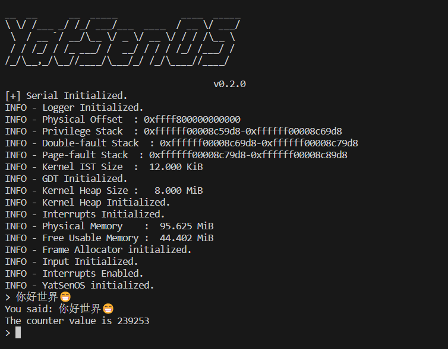

# Lab2 - 中断处理

## 代码说明

### GDT 与 TSS

此处仿照 `tss.privilege_stack_table` 的设置方式来写就可以了，首先通过 `IST_SIZES[0]` 获取栈的大小，然后通过 `STACK: [u8; STACK_SIZE] = [0; STACK_SIZE]` 来准备对应的栈，因为栈是全局使用且长期存在的，所以这里标记为 `static` 类型，接着通过 `STACK.as_ptr()` 和 `VirtAddr::from_ptr()` 函数来获得此栈对应的虚拟地址，计算得到栈底后返回给 `TSS` 即可。

`DOUBLE_FAULT_IST_INDEX` 和 `PAGE_FAULT_IST_INDEX` 的设置方式基本类似，关键代码展示如下：

```Rust
lazy_static! {
    static ref TSS: TaskStateSegment = {
        let mut tss = TaskStateSegment::new();

        // initialize the TSS with the static buffers
        // will be allocated on the bss section when the kernel is load
        tss.privilege_stack_table[0] = {
            ...
        };

        // fill tss.interrupt_stack_table with the static stack buffers like above
        // You can use `tss.interrupt_stack_table[DOUBLE_FAULT_IST_INDEX as usize]`
        tss.interrupt_stack_table[DOUBLE_FAULT_IST_INDEX as usize] = {
            const STACK_SIZE: usize = IST_SIZES[0];
            static mut STACK: [u8; STACK_SIZE] = [0; STACK_SIZE];
            let stack_start = VirtAddr::from_ptr(unsafe { STACK.as_ptr() });
            let stack_end = stack_start + STACK_SIZE;
            info!(
                "Double-fault Stack  : 0x{:016x}-0x{:016x}",
                stack_start.as_u64(),
                stack_end.as_u64()
            );
            stack_end
        };
        tss.interrupt_stack_table[PAGE_FAULT_IST_INDEX as usize] = {
            const STACK_SIZE: usize = IST_SIZES[0];
            static mut STACK: [u8; STACK_SIZE] = [0; STACK_SIZE];
            let stack_start = VirtAddr::from_ptr(unsafe { STACK.as_ptr() });
            let stack_end = stack_start + STACK_SIZE;
            info!(
                "Page-fault Stack  : 0x{:016x}-0x{:016x}",
                stack_start.as_u64(),
                stack_end.as_u64()
            );
            stack_end
        };

        tss
    };
}
```

### 注册中断处理程序

此处实验要求做 `GDT` 的初始化和中断程序的注册。

这部分的代码也是仿照 `idt.divide_error.set_handler_fn(divide_error_handler);` 的示例代码就可以了，实验要求再注册 `double_fault` 和 `page_fault` 的中断处理函数，在这里我没有深入地实现对应中断处理函数的功能，只做了一个 `panic` 处理。使用 `pub extern "x86-interrupt"` 的标识符来告诉编译器此处的汇编布局采用 `x86` 的数据格式。

```Rust
pub unsafe fn register_idt(idt: &mut InterruptDescriptorTable) {
    idt.divide_error.set_handler_fn(divide_error_handler);
    idt.double_fault
        .set_handler_fn(double_fault_handler)
        .set_stack_index(gdt::DOUBLE_FAULT_IST_INDEX);
    idt.page_fault
        .set_handler_fn(page_fault_handler)
        .set_stack_index(gdt::PAGE_FAULT_IST_INDEX);
}

pub extern "x86-interrupt" fn divide_error_handler(stack_frame: InterruptStackFrame) {
    panic!("EXCEPTION: DIVIDE ERROR\n\n{:#?}", stack_frame);
}

pub extern "x86-interrupt" fn double_fault_handler(
    stack_frame: InterruptStackFrame,
    error_code: u64,
) -> ! {
    panic!(
        "EXCEPTION: DOUBLE FAULT, ERROR_CODE: 0x{:016x}\n\n{:#?}",
        error_code, stack_frame
    );
}

pub extern "x86-interrupt" fn page_fault_handler(
    stack_frame: InterruptStackFrame,
    err_code: PageFaultErrorCode,
) {
    panic!(
        "EXCEPTION: PAGE FAULT, ERROR_CODE: {:?}\n\nTrying to access: {:#x}\n{:#?}",
        err_code,
        Cr2::read(),
        stack_frame
    );
}
```

### 初始化 APIC

这部分实验需要我们为 `APIC` 做寄存器的初始化处理。文档提供的信息很多，初始化的操作跟寄存器操作非常相像。

首先操作 `SPIV` 寄存器，启用 `APIC` 并设置 `Spurious IRQ Vector`。查询文档可知，`SPIV` 寄存器的偏移量为 `0xF0`。需要在保持其他位不变的情况下，将 `Vector` 设置为 `Irq::Spurious`，并且需要加上 `Interrupts::IrqBase`。

```Rust
let mut spiv = self.read(0xF0);
spiv |= 1 << 8;
spiv &= !(0xFF);
spiv |= Interrupts::IrqBase as u32 + Irq::Spurious as u32;
self.write(0xF0, spiv);
```

接着是设置 `LVT` 寄存器。`Local Vector Table` 寄存器用于设置中断向量号和触发模式，是要只对时钟中断做配置，需要将 `Timer` 的 `Vector` 设置为 `Irq::Timer`，表示定时器周期模式。与刚刚的 `SPIV` 寄存器的设置类似，需要在保持其他位不变的情况下，将 `Vector` 设置为 `Irq::Timer`，并且需要加上 `Interrupts::Timer`。

```Rust
self.write(0x3E0, 0b1011);
self.write(0x380, 0x20000);
let mut lvt_timer = self.read(0x320);
lvt_timer &= !(0xFF);
lvt_timer |= Interrupts::IrqBase as u32 + Irq::Timer as u32;
lvt_timer &= !(1 << 16);
lvt_timer |= 1 << 17;
self.write(0x320, lvt_timer);
```

然后我们在初始化 `APIC` 时清除错误状态寄存器中的错误信息。这部分只要向对应的寄存器写 `0` 就可以了。

```Rust
self.write(0x280, 0);
self.write(0x280, 0);
```

最后需要设置中断命令寄存器，中断命令寄存器由两个 32 位寄存器组成，一个在 `0x300`，另一个在 `0x310`。在写入 `0x300` 时发出中断，但在写入 `0x310` 时不发出中断。所以我们需要先写入 `0x310`，然后写入 `0x300`。

```Rust
self.write(0x310, 0);
const BCAST: u32 = 1 << 19;
const INIT: u32 = 5 << 8;
const TMLV: u32 = 1 << 15;
self.write(0x300, BCAST | INIT | TMLV);
const DS: u32 = 1 << 12;
while self.read(0x300) & DS != 0 {}
self.write(0x080, 0);
```

到这里就顺利配置好 `XAPIC` 并对其初始化了。

### 时钟中断

这部分的代码很简单，实验要求我们实现一个时钟计数器 `COUNTER`，并实现对应的辅助函数 `read_counter()` 和 `inc_counter()` 来实现对 `COUNTER` 的读写操作。

这里我简单地设置 `COUNTER` 为 `u64` 类型，读写操作也没有考虑互斥锁，所以是线程不安全的版本。

```Rust
pub unsafe fn register_idt(idt: &mut InterruptDescriptorTable) {
    idt[Interrupts::IrqBase as usize + Irq::Timer as usize]
        .set_handler_fn(clock_handler);
}

pub extern "x86-interrupt" fn clock_handler(_sf: InterruptStackFrame) {
    x86_64::instructions::interrupts::without_interrupts(|| {
        if inc_counter() % 0x10000 == 0 {
            // info!("Tick! @{}", read_counter());
        }
        super::ack();
    });
}

static mut COUNTER: u64 = 0;

#[inline]
pub fn read_counter() -> u64 {
    unsafe {
        COUNTER
    }
}

#[inline]
pub fn inc_counter() -> u64 {
    unsafe {
        COUNTER += 1;
        COUNTER
    }
}
```

### 串口输入中断

这里实验要求我们设置好 `uart16550` 的读写操作，在实现对应操作之前，我先封装了两个端口读写的函数粉笔是 `inb()` 和 `outb()`，这两个函数可以从对应的 `port` 读写一字节的数据。

```Rust
pub struct SerialPort{
    port : u16,
}

fn inb(port: u16) -> u8{
    unsafe{
        x86::io::inb(port)
    }
}

fn outb(port: u16, data: u8) {
    unsafe{
        x86::io::outb(port, data);
    }
}
```

做好了对端口读写的封装后，可以实现驱动的读写封装。在这里 `while(inb(self.port + 5) & 0x20) == 0` 用于等待端口的特定状态。这个方法可以在发送数据之前，检查输出缓冲区是否为空，以确保可以安全地发送数据。`inb(self.port + 5) & 1` 用来判断是否有数据输入，整个串口驱动的读写是无锁的。

```Rust
pub fn send(&mut self, data: u8) {
    while(inb(self.port + 5) & 0x20) == 0 {}
    outb(self.port, data);
}

pub fn receive(&mut self) -> Option<u8> {
    if (inb(self.port + 5) & 1) != 0 {
        return Some(inb(self.port));
    }
    None
}
```

接下来就可以实现对输入输出缓冲区的操作了，在这里我将输入输出的缓冲区定义为 128 字节大小的 `ArrayQueue::<DecodedKey>` 类型。这里一共实现了多个函数，它们对应的功能和实现原理如下：

- **push_key()**：向输入缓冲区推入一个键。如果输入缓冲区已满，将会记录一条警告日志，并丢弃被推入的键。
- **try_get_key()**：尝试从输入缓冲区中获取一个键。这个方法使用 `without_interrupts` 函数来确保在没有中断的情况下进行操作，然后调用 `get_input_buffer_for_sure` 函数获取输入缓冲区，并尝试从中弹出一个键。
- **get_key()**：从输入缓冲区中获取一个键。这个方法会循环调用 `try_get_key` 方法，直到成功获取到一个键为止。
- **get_line()**：从输入缓冲区中获取一行文本。该方法会循环调用 `get_key` 方法，直到遇到换行符为止。在获取每个键的过程中，会根据键的类型进行不同的处理，包括打印字符、删除字符等。

在初始化阶段，创建了一个固定大小的 `ArrayQueue` 实例作为键盘输入缓冲区。这个缓冲区会在程序运行期间一直存在，并且可以存储一定数量的键；当键盘中断被识别后，操作系统会调用 `push_key` 方法将接收到的键推入输入缓冲区。如果缓冲区已满，将会记录一条警告日志，并丢弃被推入的键；操作系统可以通过 `get_key` 方法从输入缓冲区中获取一个键。如果缓冲区为空，该方法会一直循环等待，直到有键可用为止；`get_line` 方法允许操作系统从输入缓冲区中获取一行文本。在获取每个键的过程中，根据键的类型进行不同的处理，包括打印字符、删除字符等。

```Rust
pub fn init() {
    init_INPUT_BUFFER(ArrayQueue::<DecodedKey>::new(INPUT_BUFFER_SIZE));
    info!("Input Initialized.");
}

pub fn push_key(key: DecodedKey) {
    if let Some(queue) = get_input_buffer(){
        if queue.push(key).is_err() {
            warn!("Input buffer is full. Dropping key '{:?}'", key);
        }
    }
}

pub fn try_get_key() -> Option<DecodedKey> {
    interrupts::without_interrupts(|| get_input_buffer_for_sure().pop())
}

pub fn get_key() -> DecodedKey {
    loop {
        if let Some(key) = try_get_key() {
            return key;
        }
    }
}

pub fn get_line() -> String {
    let mut s = String::with_capacity(INPUT_BUFFER_SIZE);
    loop {
        let key = get_key();
        if let DecodedKey::Unicode(k) = key {
            match k {
                '\n' => break,
                '\x08' => {
                    if !s.is_empty() {
                        serial::backspace();
                        s.pop();
                    }
                }
                c => {
                    print!("{}", k);
                    s.push(c)
                }
            }
        }
    }
    println!();
    s
}
```

### 用户交互

可以发现能正常产生用户交互。



## 思考任务

1. **为什么需要在 clock_handler 中使用 without_interrupts 函数？如果不使用它，可能会发生什么情况？**

    处理中断时需要先关闭中断，否则可能会同时发生多个中断请求的处理，导致 OS 崩溃。

2. **考虑时钟中断进行进程调度的场景，时钟中断的频率应该如何设置？太快或太慢的频率会带来什么问题？请分别回答。**

    设置过高会导致进程上下文切换频繁，增加了系统资源的额外消耗，比如 CPU 时间。

    设置过高会导致进程响应时间变慢，进程对资源的利用和实时性能下降。

3. **在进行 receive 操作的时候，为什么无法进行日志输出？如果强行输出日志，会发生什么情况？谈谈你对串口、互斥锁的认识。**

    receive 操作会打开串口读写缓冲区的锁，日志输出此时需要等待锁的释放。

    强行输出日志会导致多个应用同时对串口读写缓冲区的读写操作，可能会产生非预期行为或信息的丢失。

4. **输入缓冲区在什么情况下会满？如果缓冲区满了，用户输入的数据会发生什么情况？**

    当用户输入过多信息且不触发输出时会满，缓冲区满了会导致用户的输入数据发生丢失。

5. **进行下列尝试，并在报告中保留对应的触发方式及相关代码片段：**

    1. 尝试用你的方式触发 Triple Fault，开启 intdbg 对应的选项，在 QEMU 中查看调试信息，分析 Triple Fault 的发生过程。

        注释掉 `idt` 中 `page_fault` 和 `double_fault` 的注册代码便会发生 `triple_fault`。

        首先发生 `page_fault`，因为 `page_fault` 的中断处理程序没有注册，转而发生 `double_fault`，`double_fault` 的处理程序也没有注册，于是触发 `triple_fault` 重启系统，

    2. 尝试触发 Double Fault，观察 Double Fault 的发生过程。

        注释掉 `idt` 中 `page_fault` 的注册代码便会发生 `double_fault`。

        首先发生 `page_fault`，因为 `page_fault` 的中断处理程序没有注册，于是发生 `double_fault`。

    3. 通过访问非法地址触发 Page Fault，观察 Page Fault 的发生过程。分析 Cr2 寄存器的值，并尝试回答为什么 Page Fault 属于可恢复的异常。

        发生 `page_fault` 时，OS 会通过 Cr2 寄存器跳转到对应进程的页表来获取对应缺失的页面，当获取到对应页面后便可恢复正常。

    4. 如果在 TSS 中为中断分配的栈空间不足，会发生什么情况？请分析 CPU 异常的发生过程，并尝试回答什么时候会发生 Triple Fault。

        可能会在执行中断处理函数的时候发生栈溢出。在发生 Triple Fault之前，通常会发生一系列的异常和错误处理过程。如果这些处理过程中无法解决问题，就会最终导致 Triple Fault的发生。

6. **在未使用 set_stack_index 函数时，中断处理程序的栈可能哪里？**

    会在 TSS 的默认堆栈上。

## 加分任务

1. **为全部可能的 CPU 异常设置对应的处理程序，使用 panic! 输出异常信息。**

实现如下，根据不同处理程序需要的处理函数接口类型，分别定义了 `generalf_error_handler()`、`generalf1_error_handler()` 和 `generalfu_error_handler()` 函数，用 `panic` 来做对应的错误输出。

```Rust
pub unsafe fn register_idt(idt: &mut InterruptDescriptorTable) {

...

idt.debug.set_handler_fn(generalf_error_handler);
idt.non_maskable_interrupt.set_handler_fn(generalf_error_handler);
idt.breakpoint.set_handler_fn(generalf_error_handler);
idt.overflow.set_handler_fn(generalf_error_handler);
idt.bound_range_exceeded.set_handler_fn(generalf_error_handler);
idt.invalid_opcode.set_handler_fn(generalf_error_handler);
idt.device_not_available.set_handler_fn(generalf_error_handler);
idt.invalid_tss.set_handler_fn(generalfu_error_handler);
idt.segment_not_present.set_handler_fn(generalfu_error_handler);
idt.stack_segment_fault.set_handler_fn(generalfu_error_handler);
idt.general_protection_fault.set_handler_fn(generalfu_error_handler);
idt.x87_floating_point.set_handler_fn(generalf_error_handler);
idt.alignment_check.set_handler_fn(generalfu_error_handler);
idt.machine_check.set_handler_fn(generalf1_error_handler);
idt.simd_floating_point.set_handler_fn(generalf_error_handler);
idt.virtualization.set_handler_fn(generalf_error_handler);
idt.vmm_communication_exception.set_handler_fn(generalfu_error_handler);
idt.security_exception.set_handler_fn(generalfu_error_handler);
}

pub extern "x86-interrupt" fn generalf_error_handler(stack_frame: InterruptStackFrame) {
    panic!("EXCEPTION: GENERAL ERROR\n\n{:#?}", stack_frame);
}

pub extern "x86-interrupt" fn generalf1_error_handler(stack_frame: InterruptStackFrame) -> !{
    panic!(
        "EXCEPTION: GENERAL FAULT\n\n{:#?}",
        stack_frame
    );
}

pub extern "x86-interrupt" fn generalfu_error_handler(
    stack_frame: InterruptStackFrame,
    err_code: u64,
) {
    panic!("EXCEPTION: GENERAL ERROR, ERROR_CODE: {:?}\n\n{:#?}", err_code, stack_frame);
}
```

2. **你如何定义用于计数的 COUNTER，它能够做到线程安全吗？如果不能，如何修改？**

使用 `sync::spin::Mutex` 的自旋锁结构来为 `COUNTER` 上锁，当需要增加计数或读取数值时、先解锁再做对应的操作，此时可以保证线程安全。

```Rust
use sync::spin::{Mutex, Arc};

static COUNTER: Mutex<u64> = Mutex::new(0);

#[inline]
pub fn read_counter() -> u64 {
    // lock the mutex, read counter value, and unlock the mutex
    let counter = COUNTER.lock().unwrap();
    *counter
}

#[inline]
pub fn inc_counter() -> u64 {
    // lock the mutex, read counter value, increase it, and unlock the mutex
    let mut counter = COUNTER.lock().unwrap();
    *counter += 1;
    *counter
}
```

3. **操作 APIC 时存在大量比特操作，尝试结合使用 bitflags 和 bit_field 来定义和操作这些寄存器的值，从而获得更好的可读性。**

首先需要定义常用的几个 `bitflags` 类型，比如 `SpivFlags`、`LvtTimerFlags` 和 `IcrFlags`。

```Rust
use bitflags::bitflags;

bitflags! {
    struct SpivFlags: u32 {
        const ENABLE = 1 << 8;
    }
}

bitflags! {
    struct LvtTimerFlags: u32 {
        const MASK = 1 << 16;
        const TIMER_PERIODIC_MODE = 1 << 17;
    }
}

bitflags! {
    struct IcrFlags: u32 {
        const BCAST = 1 << 19;
        const INIT = 5 << 8;
        const TMLV = 1 << 15;
    }
}

```

接着便可以用刚刚定义好的三个 `bitflags` 结构体来帮助我们写出可读性更强的代码。

```Rust
use bit_field::BitField;

fn cpu_init(&mut self) {
    unsafe {
        let mut spiv = self.read(0xF0);
        spiv |= SpivFlags::ENABLE.bits();
        spiv.set_bits(0..=7, Interrupts::IrqBase as u32 + Irq::Spurious as u32);
        self.write(0xF0, spiv);

        self.write(0x3E0, 0b1011);
        self.write(0x380, 0x20000);
        let mut lvt_timer = self.read(0x320);
        lvt_timer.set_bits(0..=7, Interrupts::IrqBase as u32 + Irq::Timer as u32);
        lvt_timer.set_bits(16..=16, false);
        lvt_timer.set_bits(17..=17, true);
        self.write(0x320, lvt_timer);

        self.write(0x350, LvtTimerFlags::MASK.bits());
        self.write(0x360, LvtTimerFlags::MASK.bits());

        self.write(0x340, LvtTimerFlags::MASK.bits());

        let mut lvt_error = self.read(0x370);
        lvt_error.set_bits(0..=7, Interrupts::IrqBase as u32 + Irq::Error as u32);
        lvt_error.set_bits(16..=16, false);
        self.write(0x370, lvt_error);

        self.write(0x280, 0);
        self.write(0x280, 0);

        self.write(0x0B0, 0);

        self.write(0x310, 0);
        while self.read(0x300).get_bits(12..=12) != Some(true) {}
        self.write(0x300, IcrFlags::BCAST.bits() | IcrFlags::INIT.bits() | IcrFlags::TMLV.bits());

        self.write(0x080, 0);
    }
}
```

4. **你的串口输入驱动是否能正确的处理中文甚至 emoji 输入？如何能够正确处理？**

上网查询资料可以找到 `Rust` 有个专门处理键盘输入解码的第三方包 [pc_keyboard](https://docs.rs/pc-keyboard/latest/pc_keyboard/enum.DecodedKey.html#)。于是我在 `receive()` 函数中使用 `pc_keyboard::DecodedKey` 来对缓冲区的数据做解码工作。

```Rust
use pc_keyboard::DecodedKey;

pub extern "x86-interrupt" fn serial_handler(_st: InterruptStackFrame) {
    receive();
    super::ack();
}

/// Receive character from uart 16550
/// Should be called on every interrupt
fn receive() {
    // receive character from uart 16550, put it into INPUT_BUFFER
    let mut buf = vec::Vec::with_capacity(4);
    while let Some(scancode) = get_serial_for_sure().receive() {
        match scancode {
            127 => push_key(DecodedKey::Unicode('\x08')),
            13 => push_key(DecodedKey::Unicode('\n')),
            c => {
                buf.push(c);

                if let Ok(s) = core::str::from_utf8(&buf) {
                    let chr = s.chars().next().unwrap();
                    push_key(DecodedKey::Unicode(chr));
                    buf.clear();
                }
            }
        }
    }
}
```

发现可以实现中文或 emoji 的解码操作。

