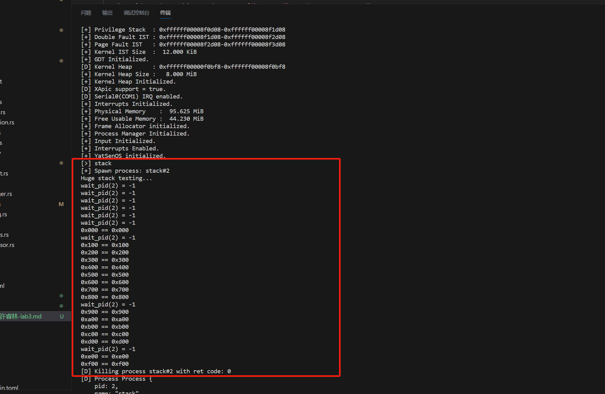

# Lab3 - 内核线程与缺页异常

## 代码说明

### 进程管理器的初始化

这里实验要求我们做进程管理器的初始化。首先，我初始化了内核进程的栈 `stack_top`，将其设置为虚拟地址 `VirtAddr::new(KSTACK_INIT_BOT)`，并设置栈的大小为 `KSTACK_DEF_PAGE`。然后我创建了一个 `ProcessData` 结构体对象 `kproc_data`，用于存储内核进程的相关信息。这里对 `kproc_data` 做默认的结构体初始化。

```Rust
let stack_top = VirtAddr::new(KSTACK_INIT_BOT);
let mut kproc_data = ProcessData::new();
kproc_data.set_stack(stack_top, KSTACK_DEF_PAGE);
```

接着创建内核进程 `kproc`，其中传入了内核进程的名称、父进程为 `None`、初始化寄存器数据为默认数据，并将前面创建的 `kproc_data` 传递给它。最后，我们将创建的内核进程传递给 `manager::init()` 函数，这个函数会初始化全局唯一的进程管理器，标注内核进程的状态并初始化进程调度队列。

```Rust
let kproc = Process::new(
    String::from("kernel"),
    None,
    PageTableContext::new(),
    Some(kproc_data),
);

manager::init(kproc);
```

### 进程调度的实现

在 `save_current()` 函数中，我们先获取当前进程管理器的进程对象 `current`，接着使用 `inner.save(context);` 来保存需要切换的进程的数据，并根据状态 `inner.status();` 将其加入就绪队列或标记为死亡进程。

```Rust
pub fn save_current(&self, context: &ProcessContext) {
    let current = self.current();
    let pid = current.pid();

    let mut inner = current.write();
    inner.tick();
    inner.save(context);
    let status = inner.status();
    drop(inner);

    // debug!("Save process {} #{}", current.name(), pid);

    if status != ProgramStatus::Dead {
        self.push_ready(pid);
    } else {
        debug!("Process {:#?} #{} is dead", current, pid);
    }
}
```

在 `switch_next()` 函数中，它将用于切换到下一个就绪进程，我首先从进程队列 `self.ready_queue` 里弹出一个进程，并根据这个进程的进程号来判断是否需要做进程切换，切换时使用 `proc.write().restore(context);` 来修改当前进程管理器的寄存器信息，因为提前在 `save_current()` 函数里处理了进程阻塞和死亡的情况，所以此处不需要额外判断来确保切换的进程状态正确。

```Rust
pub fn switch_next(&self, context: &mut ProcessContext) -> ProcessId {
    let mut pid = processor::current_pid();

    while let Some(next) = self.ready_queue.lock().pop_front() {
        let map = self.processes.read();
        let proc = map.get(&next).expect("Process not found");

        if !proc.read().is_ready() {
            debug!("Process #{} is {:?}", next, proc.read().status());
            continue;
        }

        // debug!("Switch process {} #{}", proc.read().name(), next);

        if pid != next {
            proc.write().restore(context);
            processor::set_pid(next);
            pid = next;
        }

        break;
    }

    pid
}
```

最后在 `switch()` 函数中，利用宏重新定义中断处理函数，通过调用上文写好的进程管理器的 `save_current()` 和 `switch_next()` 函数进行进程调度切换。

```Rust
pub fn switch(context: &mut ProcessContext) {
    x86_64::instructions::interrupts::without_interrupts(|| {
        let manager = get_process_manager();
        manager.save_current(context);
        manager.switch_next(context);
    });
}
```

### 进程信息的获取

首先是获取进程的环境变量，这部分的实现比较简单，我先通过 `get_process_manager().current().read()` 尝试获取当前进程的读锁，并查询对应 `ProcessData` 的 `env()` 函数。因为在 `ProcessData` 中依旧封装好了 `env()` 函数，所以这部分的代码只需要一行就可以实现。

```Rust
pub fn env(key: &str) -> Option<String> {
    x86_64::instructions::interrupts::without_interrupts(|| {
        get_process_manager().current().read().env(key)
    })
}
```

接着是获取进程的返回值，我先参照上文类似的设计编写了 `get_process_manager().wait_pid(pid)` 函数，这个函数用于等待对应传入的 `pid` 进程结束。当父进程等待子进程结束时，每过一段时间父进程就会调用 `wait_pid()` 函数，进程管理器会关闭中断并查询对应子进程的返回值，如果子进程成功返回，便会释放子进程的资源并告知父进程，并把子进程的返回值交给父进程。

```Rust
pub fn wait_pid(pid: ProcessId) -> isize {
    x86_64::instructions::interrupts::without_interrupts(|| get_process_manager().wait_pid(pid))
}

pub fn wait_pid(&self, pid: ProcessId) -> isize {
    self.get_proc(&pid)
        .and_then(|p| p.read().exit_code())
        .unwrap_or(-1)
}
```

### 内核线程的创建

运行 `spawn_kernel_thread()` 函数前，首先使用 `without_interrupts` 宏关闭中断，以确保在执行过程中不会被中断打断，从而保证了操作的原子性和一致性。获取当前内核进程 `kproc`，接着获取当前内核进程的页表 `page_table`，以便后续为新创建的内核线程分配内存空间。

接着创建新的进程对象 `proc`，其中包括了进程的名称、父进程、页表和其他相关信息。调用 `alloc_init_stack()` 函数为内核进程分配初始化栈空间，该函数根据预设的内存布局和当前进程的 `PID` 分配栈空间。

创建好内核进程后，需要将内核进程放入进程队列来进行调度。通过 `proc.write()` 获取进程对象的写锁，暂停进程的执行，然后调用 `inner.init_stack_frame(entry, stack_top)` 初始化进程的栈帧，将入口地址和栈顶地址设置为上文中计算好的内存地址。

完成进程的初始化后，获取进程的 `PID`，并返回对应的 `PID` 表示进程创建成功。通过 `add_proc(pid, proc)` 和 `push_ready(pid)` 将进程添加到进程管理器的进程列表中，并将其加入就绪队列，以便后续可以被调度执行。

```Rust
pub fn spawn_kernel_thread(entry: fn() -> !, name: String, data: Option<ProcessData>) -> ProcessId {
    x86_64::instructions::interrupts::without_interrupts(|| {
        let entry = VirtAddr::new(entry as usize as u64);
        get_process_manager().spawn_kernel_thread(entry, name, data)
    })
}

pub fn spawn_kernel_thread(
    &self,
    entry: VirtAddr,
    name: String,
    proc_data: Option<ProcessData>,
) -> ProcessId {
    let kproc = self.get_proc(&KERNEL_PID).unwrap();
    let page_table = kproc.read().clone_page_table();
    let proc = Process::new(name, Some(Arc::downgrade(&kproc)), page_table, proc_data);

    let stack_top = proc.alloc_init_stack();
    let mut inner = proc.write();
    inner.pause();
    inner.init_stack_frame(entry, stack_top);

    let pid = proc.pid();
    info!("Spawn process: {}#{}", inner.name(), pid);
    drop(inner);

    self.add_proc(pid, proc);
    self.push_ready(pid);

    pid
}
```

在实现内核线程的创建后，尝试在 `kernel_main` 中使用 `test` 命令来创建多个内核线程，发现能够并发地调度执行。


### 缺页异常的处理

运行 `handle_page_fault()` 函数前，首先使用 `without_interrupts` 宏关闭中断，以确保在执行过程中不会被中断打断，从而保证了操作的原子性和一致性。

```Rust
pub fn handle_page_fault(addr: VirtAddr, err_code: PageFaultErrorCode) -> bool {
    x86_64::instructions::interrupts::without_interrupts(|| {
        get_process_manager().handle_page_fault(addr, err_code)
    })
}
```

在 `try_alloc_new_stack_page()` 函数中，我根据给定的虚拟地址 `addr`，通过 `Page::<Size4KiB>::containing_address(addr)` 确定其所在的页面 `new_start_page`。并通过 `stack_segment` 获取当前进程的栈信息 `old_stack`，包括当前进程对应栈的起始页和结束页。

接着计算需要填充的页面数量 `pages`，即当前栈的起始页到 `addr` 所在页之间的页面数量，直接做相减操作即可。接着用 `mapper()` 函数获取当前进程的页表，并通过 `elf::map_range()` 函数将新页面映射到地址空间中，完成页面的分配，并更新进程的栈信息，包括栈的起始页和结束页，以及栈的内存使用情况。

最后返回成功结果表示页面分配完成。

```Rust
pub fn try_alloc_new_stack_page(&mut self, addr: VirtAddr) -> Result<(), MapToError<Size4KiB>> {
    let alloc = &mut *get_frame_alloc_for_sure();
    let new_start_page = Page::<Size4KiB>::containing_address(addr);
    let old_stack = self.proc_data.as_ref().unwrap().stack_segment.unwrap();

    let pages = old_stack.start - new_start_page;
    let page_table = &mut self.page_table.as_mut().unwrap().mapper();

    trace!(
        "Fill missing pages...[{:#x} -> {:#x}) ({} pages)",
        new_start_page.start_address().as_u64(),
        old_stack.start.start_address().as_u64(),
        pages
    );

    elf::map_range(addr.as_u64(), pages, page_table, alloc)?;

    let new_stack = PageRange {
        start: new_start_page,
        end: old_stack.end,
    };

    let proc_data = self.proc_data.as_mut().unwrap();
    proc_data.stack_memory_usage = new_stack.count();
    proc_data.stack_segment = Some(new_stack);

    Ok(())
}
```

在实现缺页异常的处理后，在 `kernel_main` 中使用 `stack` 命令来创建一个栈使用很大的内核线程，发现它能被正确地处理，不会导致进程的崩溃。



## 思考任务

1. **为什么在初始化进程管理器时需要将它置为正在运行的状态？能否通过将它置为就绪状态并放入就绪队列来实现？这样的实现可能会遇到什么问题？**

    因为进程管理器在做进程切换时，会先保存当前运行进程的状态，再从就绪队列中取一个进程的上下文来切换。如果初始化进程管理器时不设置为运行状态，在后续的实现中可能会遇到当前运行进程为 `None` 的情况。

    并且同时为了确保操作系统能够立即开始运行，而不需要额外的启动过程。通过将进程管理器置为正在运行状态，操作系统可以立即开始调度和执行进程，而不必等待其他进程的就绪。

2. **在 src/proc/process.rs 中，有两次实现 Deref 和一次实现 DerefMut 的代码，它们分别是为了什么？使用这种方式提供了什么便利？**

    这是为了实现智能指针 `ProcessRef` 和 `ProcessRefMut`，以提供对进程对象的方便访问和操作。

    通过使用智能指针可以避免直接操作裸指针带来的安全风险，同时提供了更加友好和方便的接口来访问和操作进程对象。

3. **中断的处理过程默认是不切换栈的，即在中断发生前的栈上继续处理中断过程，为什么在处理缺页异常和时钟中断时需要切换栈？如果不为它们切换栈会分别带来哪些问题？**

    因为处理缺页异常和时钟中断需要较多的栈空间，超出了当前进程持有的栈大小。

    不切换栈可能会导致栈溢出、栈污染、安全性问题、中断响应延迟、中断嵌套问题和进程调度延迟等问题。