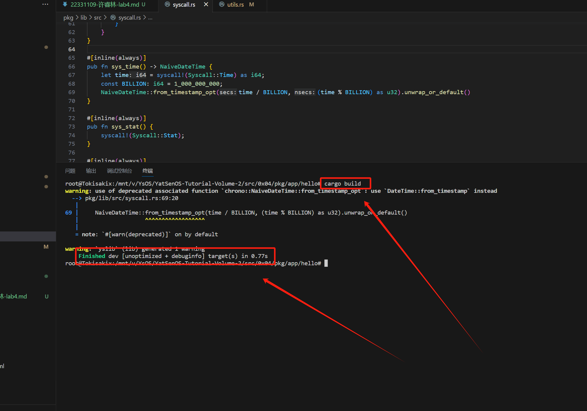
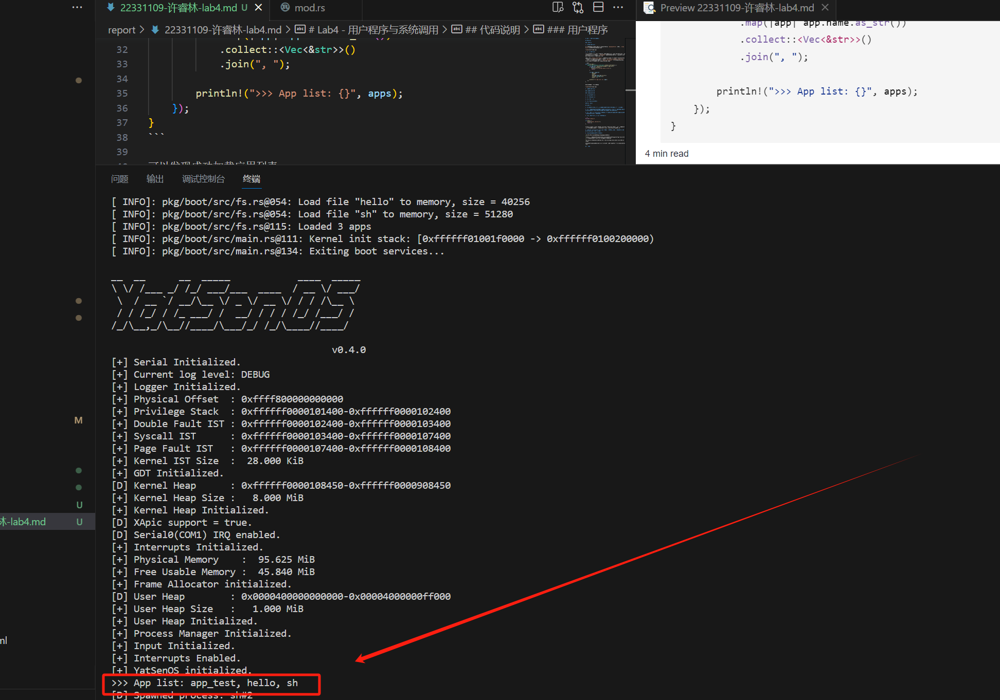
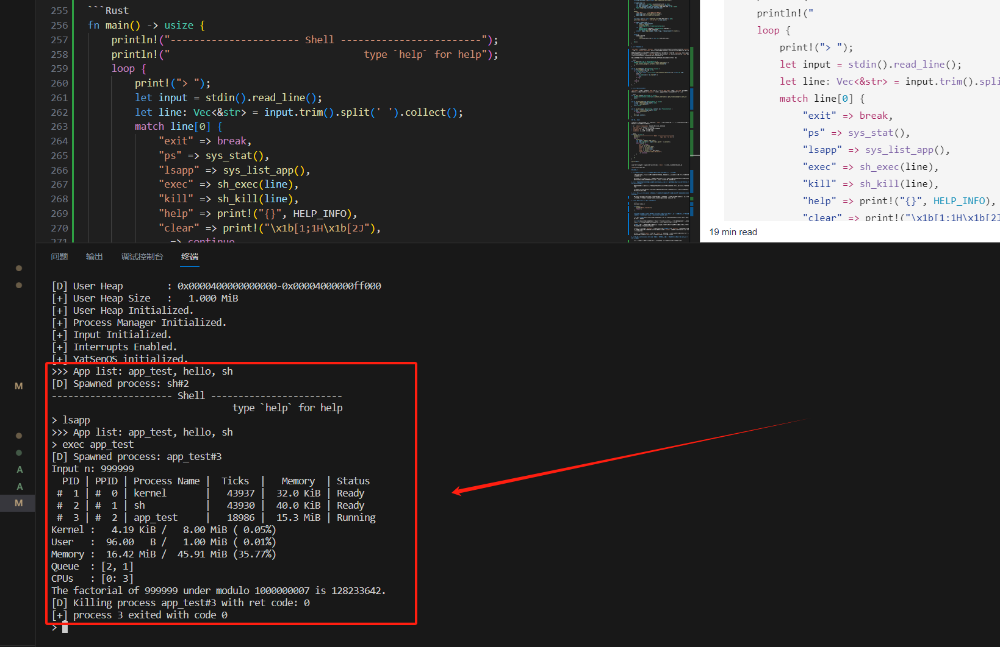
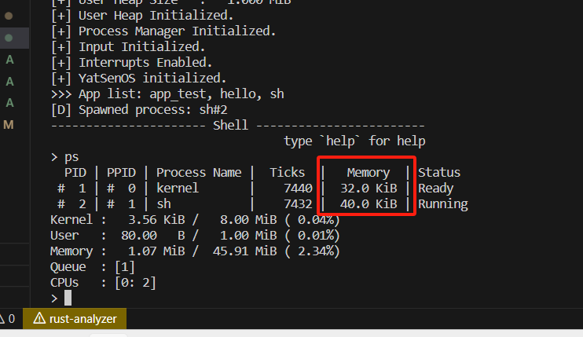

# Lab4 - 用户程序与系统调用

## 代码说明

### 用户程序

1. **编译用户程序**

依照文档要求做好编译配置后，进入到对应的目录 `pkg/app/hello/` 下运行 `cargo build`，发现可以正常地编译程序。



2. **加载用户程序**

在当前内核版本中，尚不具备访问磁盘和文件系统的能力，也没有实现用户程序的加载功能。因此，在实验中需要通过 `bootloader` 将符合条件的用户程序加载到内存中，并将它们交给内核，用于生成用户进程。

我先使用了 `without_interrupts()` 函数来确保在处理过程中不会被中断打断，以防止数据不一致性。然后，我们获取进程管理器 `get_process_manager().app_list()` 中的应用程序列表，如果列表为空 `app_list.is_none()` ，则打印提示信息；否则，我们将应用程序列表转换为字符串，并打印出来。

```Rust
pub fn list_app() {
    x86_64::instructions::interrupts::without_interrupts(|| {
        let app_list = get_process_manager().app_list();
        if app_list.is_none() {
            println!(">>> No app found in list!");
            return;
        }

        let apps = app_list
            .unwrap()
            .iter()
            .map(|app| app.name.as_str())
            .collect::<Vec<&str>>()
            .join(", ");

        println!(">>> App list: {}", apps);
    });
}
```

可以发现成功加载应用列表。



3. **生成用户程序**

本部分涉及到用户级线程的创建和切换。在加载用户程序的过程中，需要实现对 ELF 文件的加载，并根据参数控制页面映射是否可被用户权限的代码访问。这个过程中需要考虑安全性，防止用户态程序访问内核的内存空间。

首先获取了用于分配物理页面的分配器 `alloc` ，并获取当前进程的页表 `page_table`。然后，调用 `elf::load_elf()` 函数加载 `ELF` 文件的代码段，并进行页面映射。在页面映射时，根据传入的参数 `USER_ACCESSIBLE` 控制页面映射是否可被用户权限的代码访问。接着映射了堆栈区域。最后，记录了内存使用情况，包括代码段和堆栈的内存使用量 `code_memory_usage` 和 `stack_segment`，并将其存储在进程数据结构中。

```Rust
pub fn load_elf(&mut self, elf: &ElfFile) {
    let alloc = &mut *get_frame_alloc_for_sure();

    let page_table = self.page_table.as_ref().unwrap();
    let mut mapper = page_table.mapper();

    let code_segments = elf::load_elf(
        elf,
        *PHYSICAL_OFFSET.get().unwrap(),
        &mut mapper,
        alloc,
        true,
    )
    .unwrap();

    let stack_segment =
        elf::map_range(STACT_INIT_BOT, STACK_DEF_PAGE, &mut mapper, alloc, true).unwrap();

    // record memory usage
    let proc_data = self.proc_data.as_mut().unwrap();
    proc_data.code_memory_usage = code_segments.iter().map(|seg| seg.count()).sum();
    proc_data.stack_memory_usage = stack_segment.count();
    proc_data.code_segments = Some(code_segments);
    proc_data.stack_segment = Some(stack_segment);
}
```

通过 `self.get_proc(&KERNEL_PID).unwrap();` 获取了内核进程 `kproc` ，并复制了其页表以创建新线程的页表。然后，我们调用 `Process::new()` 创建了一个新的进程对象，指定了进程的名称、父进程、页表和进程数据。

接着，我们对新进程进行了一系列初始化操作，包括加载 `ELF` 文件和初始化堆栈帧。在加载 `ELF` 文件时，我们使用了 `ELF` 文件的入口点 `elf.header.pt2.entry_point()` 作为新线程的执行入口。最后，我们将新进程添加到进程管理器 `self.add_proc(pid, proc)` 中，并将其标记为就绪状态 `inner.pause()`。

```Rust
pub fn spawn(
    &self,
    elf: &ElfFile,
    name: String,
    parent: Option<Weak<Process>>,
    proc_data: Option<ProcessData>,
) -> ProcessId {
    let kproc = self.get_proc(&KERNEL_PID).unwrap();
    let page_table = kproc.read().clont_page_table();
    let proc = Process::new(name, parent, page_table, proc_data);

    let mut inner = proc.write();
    inner.pause();
    inner.load_elf(elf);
    inner.init_stack_frame(
        VirtAddr::new_truncate(elf.header.pt2.entry_point()),
        VirtAddr::new_truncate(STACK_INIT_TOP),
    );
    drop(inner);

    trace!("New {:#?}", &proc);

    let pid = proc.pid();
    self.add_proc(pid, proc);
    self.push_ready(pid);

    pid
}
```

### 系统调用的实现

在 `reg_idt()` 函数中，完成了对中断描述符表 (IDT) 的初始化，注册了 `0x80` 号中断的处理函数为 `syscall_handler`。接着使用 `consts::Interrupts::Syscall` 来表示系统调用中断，直接在该位置设置系统调用处理函数即可。与时钟中断类似，这里为系统调用准备一个独立的栈，并使用 `set_privilege_level` 设置 DPL 为 3，以便用户态程序可以触发系统调用。

`syscall()` 函数是实际处理系统调用的函数。当系统调用发生时，它会被触发，并调用 `super::syscall::dispatcher()` 函数来分发系统调用。

```Rust
pub unsafe fn reg_idt(idt: &mut InterruptDescriptorTable) {
    idt[consts::Interrupts::Syscall as usize]
        .set_handler_fn(syscall_handler)
        .set_stack_index(gdt::SYSCALL_IST_INDEX)
        .set_privilege_level(x86_64::PrivilegeLevel::Ring3);
}

pub extern "C" fn syscall(mut context: ProcessContext) {
    x86_64::instructions::interrupts::without_interrupts(|| {
        super::syscall::dispatcher(&mut context);
    });
}

as_handler!(syscall);
```

### 用户态库的实现

1. **动态内存分配**

这部分的实验要求我们补全用户态堆初始化的过程，`init_user_heap()` 函数是用户态堆初始化的入口函数，在函数内部，首先获取了页表映射器和帧分配器的可变引用，这两个组件是实现内存分配的关键。

通过计算可以确定用户堆的起始页和结束页，并将其范围保存在 `page_range` 中。这里用到了用户堆的起始地址 `USER_HEAP_START` 和页面数量 `USER_HEAP_PAGE`。通过一个循环，遍历了 `page_range` 中的每一页。在循环中，首先通过 `frame_allocator` 分配一个物理页帧，然后设置页表标志位，包括 `PRESENT`、`WRITABLE` 和 `USER_ACCESSIBLE`，表示页面存在、可写且可用户态访问。

接着使用 `mapper.map_to()` 方法将物理页帧映射到虚拟页 `page`，并刷新 TLB(Translation Lookaside Buffer)以确保映射生效。最后，使用 `unsafe` 块初始化了用户态的分配器 `USER_ALLOCATOR`，该分配器用于管理用户态堆的内存分配。

```Rust
pub fn init() {
    init_user_heap().expect("User Heap Initialization Failed.");
    info!("User Heap Initialized.");
}

pub fn init_user_heap() -> Result<(), MapToError<Size4KiB>> {
    let mapper = &mut *super::get_page_table_for_sure();
    let frame_allocator = &mut *super::get_frame_alloc_for_sure();

    let page_range = {
        let heap_start = VirtAddr::new(USER_HEAP_START as u64);
        let heap_start_page = Page::containing_address(heap_start);
        let heap_end_page = heap_start_page + USER_HEAP_PAGE as u64 - 1u64;
        Page::range(heap_start_page, heap_end_page)
    };

    debug!(
        "User Heap        : 0x{:016x}-0x{:016x}",
        page_range.start.start_address().as_u64(),
        page_range.end.start_address().as_u64()
    );

    let (size, unit) = super::humanized_size(USER_HEAP_SIZE as u64);
    info!("User Heap Size   : {:>7.*} {}", 3, size, unit);

    for page in page_range {
        let frame = frame_allocator
            .allocate_frame()
            .ok_or(MapToError::FrameAllocationFailed)?;
        let flags =
            PageTableFlags::PRESENT | PageTableFlags::WRITABLE | PageTableFlags::USER_ACCESSIBLE;
        unsafe { mapper.map_to(page, frame, flags, frame_allocator)?.flush() };
    }

    unsafe {
        USER_ALLOCATOR
            .lock()
            .init(USER_HEAP_START as *mut u8, USER_HEAP_SIZE);
    }

    Ok(())
}
```

2. **标准输入输出**

`sys_read()` 函数首先调用 `handle()` 函数，该函数根据文件描述符（fd）获取对应的资源。`handle()` 函数使用 `without_interrupts` 来确保在处理系统调用时不会被中断打断，以保证系统调用的原子性。

成功获取到资源后，尝试从资源中读取数据。首先，通过将用户程序传递的参数 `args.arg1` 解释为指向用户程序缓冲区的指针，并根据 `args.arg2` 指定的长度创建缓冲区 `buf`。然后，调用资源的 `read` 方法尝试从内核输入缓冲区中读取数据到用户程序的缓冲区中。

如果读取成功，则返回实际读取的字节数；如果资源不存在或读取失败，则返回 0。

```Rust
pub fn handle(fd: u8) -> Option<Resource> {
    x86_64::instructions::interrupts::without_interrupts(|| {
        get_process_manager().current().read().handle(fd)
    })
}

pub fn sys_read(args: &SyscallArgs) -> usize {
    let fd = handle(args.arg0 as u8);
    if let Some(res) = fd {
        let buf = unsafe { core::slice::from_raw_parts_mut(args.arg1 as *mut u8, args.arg2) };
        if let Some(size) = res.read(buf) {
            size
        } else {
            0
        }
    } else {
        0
    }
}
```

3. **进程的创建与等待**

`wait_pid()` 函数用于等待指定 `PID` 的进程退出，`sys_wait_pid()` 函数为 `wait_pid` 的系统调用接口，用于用户态程序调用，`sys_kill()` 函数用于向指定PID的进程发送信号以终止其执行。

```Rust
pub fn wait_pid(pid: ProcessId) -> isize {
    x86_64::instructions::interrupts::without_interrupts(|| get_process_manager().wait_pid(pid))
}

pub fn sys_wait_pid(args: &SyscallArgs) -> usize {
    let pid = ProcessId(args.arg0 as u16);
    let ret = wait_pid(pid);
    ret as usize
}

pub fn sys_kill(args: &SyscallArgs, context: &mut ProcessContext) {
    let pid = ProcessId(args.arg0 as u16);
    if pid == ProcessId(1) {
        return;
    }
    kill(pid, context);
}
```

### 运行 Shell

完成上述任务之后我编写了一个简单的命令行 `shell` 实现，它允许用户执行一些基本的命令并与系统进行交互。其中对应的功能说明如下：

- 通过 `stdin().read_line()` 来获取用户在命令行的输入。
- `sys_stat()` 用于展现当前进程状态。
- `sys_list_app()` 用于列出当前的用户程序列表。
- `sh_exec()` 用于运行一个用户程序。
- `sh_kill()` 用于关闭一个用户进程。

```Rust
fn main() -> usize {
    println!("---------------------- Shell ------------------------");
    println!("                                 type `help` for help");
    loop {
        print!("> ");
        let input = stdin().read_line();
        let line: Vec<&str> = input.trim().split(' ').collect();
        match line[0] {
            "exit" => break,
            "ps" => sys_stat(),
            "lsapp" => sys_list_app(),
            "exec" => sh_exec(line),
            "kill" => sh_kill(line),
            "help" => print!("{}", HELP_INFO),
            "clear" => print!("\x1b[1;1H\x1b[2J"),
            _ => continue,
        }
    }

    0
}

entry!(main);
```

我将测试程序组织成一个新的用户程序，并尝试在 `Shell` 中启动运行，发现可以正常运行。



## 思考任务

1. **是否可以在内核线程中使用系统调用？并借此来实现同样的进程退出能力？**

    是可能的，内核线程通常是由操作系统内核直接管理和调度的，它们通常不会像用户空间进程那样直接调用系统调用。

    要在内核线程中实现类似进程退出的功能，最好的方式是通过与操作系统内核的交互接口，例如内核模块或者内核的特定功能。这样可以确保安全性和稳定性，同时实现所需的功能。

2. **为什么需要克隆内核页表？在系统调用的内核态下使用的是哪一张页表？用户态程序尝试访问内核空间会被正确拦截吗？**

    克隆内核页表是为了确保在进程切换到内核态时，它只能访问自己的内核空间，而不是其他进程的内核空间。

    当用户态程序尝试访问内核空间时，操作系统会正确地拦截这些访问。这通常通过硬件机制（如页表和内存保护单元）来实现。

3. **为什么在使用 still_alive 函数判断进程是否存活时，需要关闭中断？在不关闭中断的情况下，会有什么问题？**

    如果不关中断，可能在会在判断进程状态时发生一些不可知的行为；如果不关闭中断可以在检查进程状态期间发生进程被调度，中断处理程序运行等情况，无法保证了检查的原子性。

4. **对于如下程序，使用 gcc 直接编译：**

    ```C
    #include <stdio.h>

    int main() {
        printf("Hello, World!\n");
        return 0;
    }
    ```

    **从本次实验及先前实验的所学内容出发，结合进程的创建、链接、执行、退出的生命周期，参考系统调用的调用过程（可以仅以 Linux 为例），解释程序的运行。**

    使用 gcc **编译**这个程序时，编译器会将源代码转换为目标代码（汇编代码），然后再将目标代码转换为可执行文件。

    在**链接**阶段，编译器将生成的目标代码与标准C库或其他依赖库进行链接，生成最终的可执行文件。在这个过程中，编译器会将printf函数调用与标准C库中的printf函数进行关联。

    当**运行**可执行文件时，操作系统会创建一个新的进程来承载这个程序。操作系统会为这个进程分配资源，例如内存空间、文件描述符等。

    在程序执行期间，调用 `printf()` 函数时，会涉及到**系统调用**。 `printf()` 函数会向操作系统发出写操作请求，操作系统会调用相应的系统调用，例如 `write()` 系统调用，将字符串输出到标准输出流(stdout)。

    当程序执行完成时，`main()` 函数中的 `return 0;` 语句会将退出码返回给操作系统，表示程序执行的状态。操作系统会释放分配给该进程的资源，并将进程从系统中移除。

5. **x86_64::instructions::hlt 做了什么？为什么这样使用？为什么不可以在用户态中的 wait_pid 实现中使用？**

    它用于在处理器空闲时暂停处理器的执行，直到收到一个中断或者其他外部事件唤醒它。

    `wait_pid` 的目的是等待一个子进程结束，并返回其状态。如果在用户态中的 `wait_pid` 实现中使用 hlt 指令，那么当处理器执行到这条指令时，整个处理器都会进入停滞状态，导致系统无法继续处理其他任务，这将导致系统失去响应或者进程无法继续执行。

6. **请结合下列情景材料回答问题**

    >有同学在某个回南天迷蒙的深夜遇到了奇怪的问题：
    >
    >只有当进行用户输入（触发了串口输入中断）的时候，会触发奇怪的 Page Fault，然而进程切换、内存分配甚至 fork 等系统调用都很正常。
    >
    >经过近三个小时的排查，发现他将 TSS 中的 privilege_stack_table 相关设置注释掉了。

    **请查阅资料，了解特权级栈的作用，实验说明这一系列中断的触发过程，尝试解释这个现象。**

    Privilege Level Stack 是 x86 架构中 TSS 的一部分，用于存储不同特权级别下的堆栈地址。通常有Ring 0 和Ring 3 两个主要级别。

    当处理器切换特权级别时，处理器会自动切换堆栈。确保在不同特权级别下使用正确的堆栈，以防止发生安全问题或者错误的数据访问。

    正常情况下，当处理器处理系统调用从用户态切换到内核态时，需要使用内核态的堆栈，因此处理器会自动切换到 TSS 中指定的内核态堆栈地址。如果 TSS 中的 privilege_stack_table 相关设置被注释掉，处理器可能无法正确地获取内核态堆栈地址，导致堆栈切换失败。在堆栈切换失败的情况下，处理器可能会尝试使用无效的堆栈地址，导致 Page Fault 异常的发生。

    而对于进程切换、内存分配和 fork 等系统调用，它们并不需要对底层硬件获取极大的控制权，处理时强制需要 Ring 0 的权限；而对于串口输入中断，需要对底层硬件获取极大的控制权，处理时会切换到 Ring 0 的内核态堆栈地址，故发生 Page Fault 异常。

## 加分项

1. **尝试在 ProcessData 中记录代码段的占用情况，并统计当前进程所占用的页面数量，并在打印进程信息时，将进程的内存占用打印出来。**

    在切换用户线程时，我们多维护两个成员变量 `code_memory_usage` 和 `stack_memory_usage`，指示了进程的内存占用信息，在打印进程信息时用上。

    ```Rust
    proc_data.code_memory_usage = code_segments.iter().map(|seg| seg.count()).sum();
    proc_data.stack_memory_usage = stack_segment.count();
    ```

    

2. **尝试在 kernel/src/memory/frames.rs 中实现帧分配器的回收功能 FrameDeallocator，作为一个最小化的实现，你可以在 Allocator 使用一个 Vec 存储被释放的页面，并在分配时从中取出。**

    此题回答合并在加分项 3 中。

3. **基于帧回收器的实现，在 elf 中实现 unmap_range 函数，从页表中取消映射一段连续的页面，并使用帧回收器进行回收。之后，在合适的地方，结合 ProcessData 中存储的页面信息，利用这个函数实现进程栈的回收。**

    `unmap_range` 接受了一些参数，包括要取消映射的起始地址 `addr`，要取消映射的页面数量 `pages`，还有用于映射的页表和用于释放帧的帧释放器。`do_dealloc` 用于指示是否应该释放相关的帧。

    在函数开始处，记录了正在取消映射的内存范围的起始地址，接着循环遍历该范围内的每一页。对于每一页，我们首先调用页表的 `unmap` 方法来取消映射它，并将相关信息存储在一个变量中。如果 `do_dealloc` 为真，则通过帧释放器释放相关的帧。

    ```Rust
    pub fn unmap_range(
        addr: u64,
        pages: u64,
        page_table: &mut impl Mapper<Size4KiB>,
        frame_deallocator: &mut impl FrameDeallocator<Size4KiB>,
        do_dealloc: bool,
    ) -> Result<(), UnmapError> {
        trace!("Unmapping stack at {:#x}", addr);

        let range_start = Page::containing_address(VirtAddr::new(addr));

        trace!(
            "Mem range hint: {:#x} -> {:#x}",
            addr,
            page_table
                .translate_page(range_start)
                .unwrap()
                .start_address()
        );

        let range_end = range_start + pages;

        trace!(
            "Page Range: {:?}({})",
            Page::range(range_start, range_end),
            pages
        );

        for page in Page::range(range_start, range_end) {
            let info = page_table.unmap(page)?;
            if do_dealloc {
                unsafe {
                    frame_deallocator.deallocate_frame(info.0);
                }
            }
            info.1.flush();
        }

        Ok(())
    }
    ```

4. **尝试利用 UefiRuntime 和 chrono crate，获取当前时间，并将其暴露给用户态，以实现 sleep 函数。**

    实现如下：

    ```Rust
    pub fn sleep(millisecs: i64) {
        let start = sys_time();
        let dur = Duration::try_milliseconds(millisecs).unwrap();
        let mut current = start;
        while current - start < dur {
            current = sys_time();
        }
    }
    ```