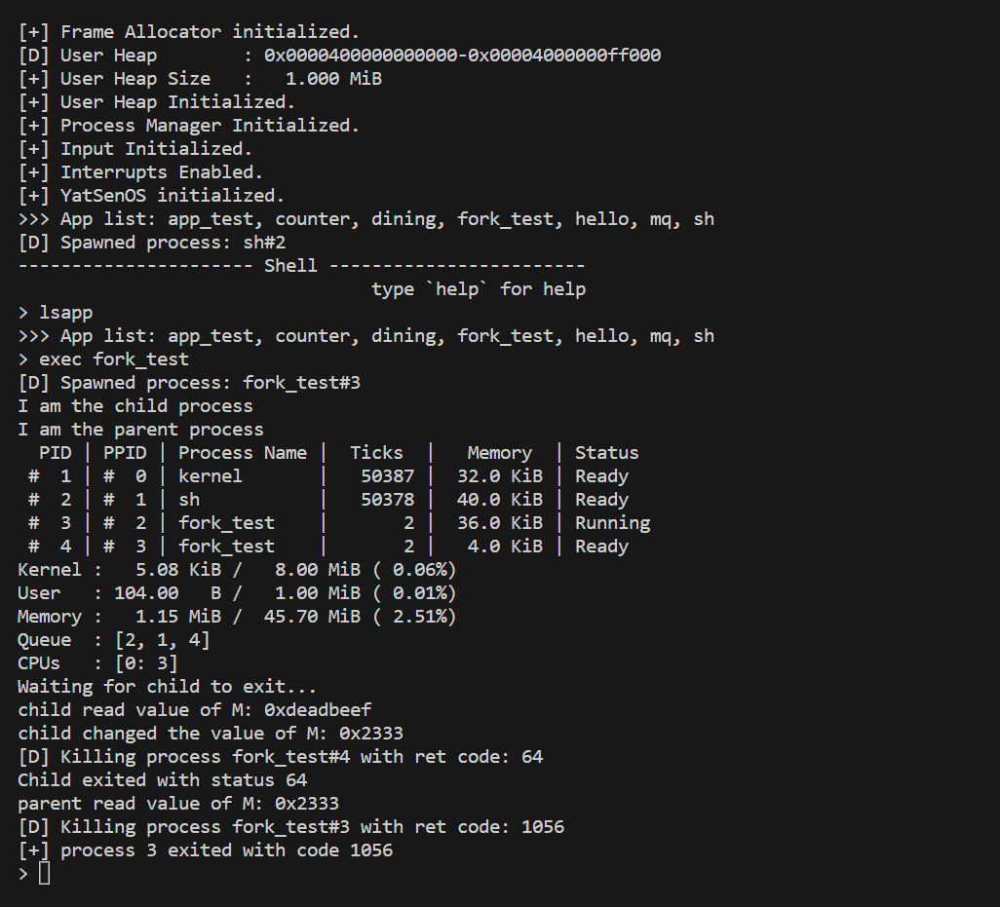
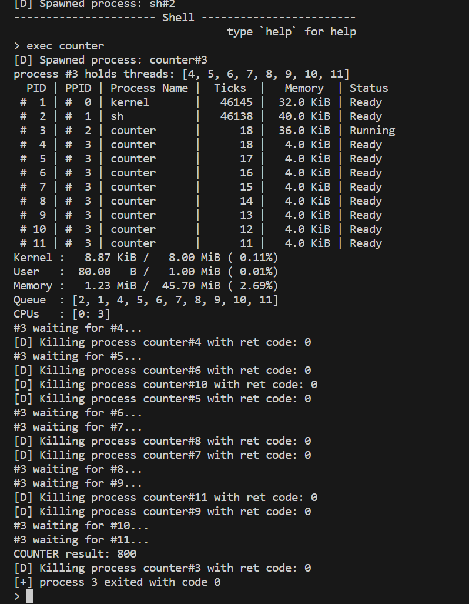
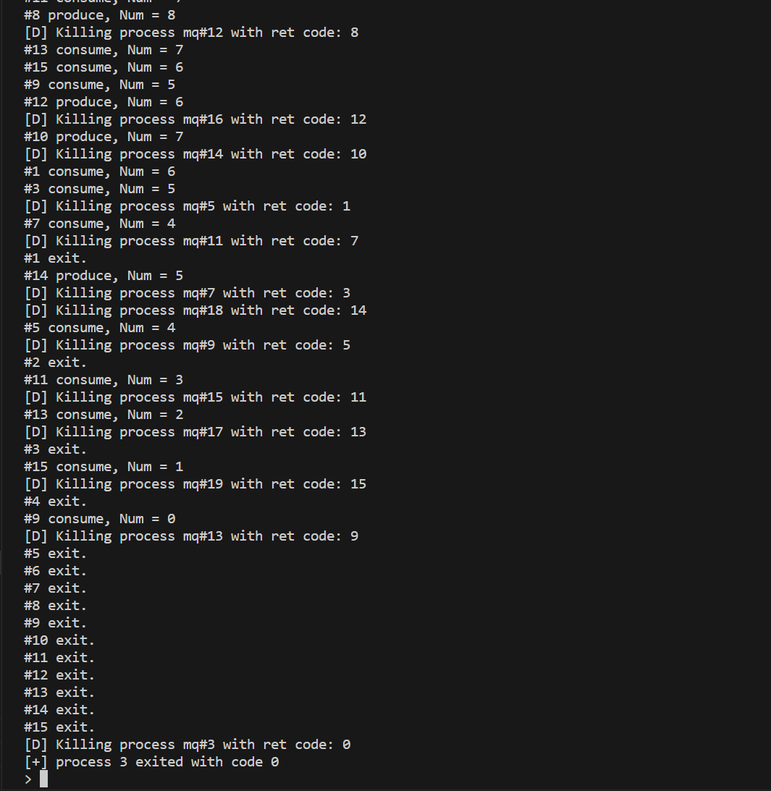
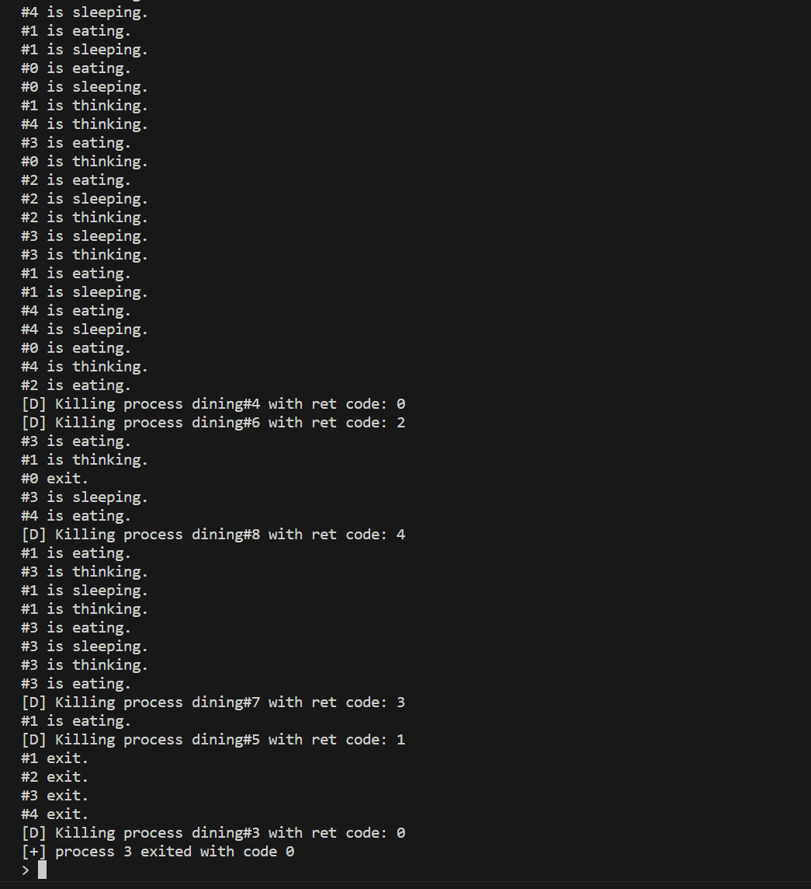

# Lab5 - Fork 的实现、并发与锁机制

## 代码说明

### Fork 的实现

**添加系统调用**

在 `/src/interrupt/syscall/mod.rs` 中添加 Fork 的系统调用接口：

```Rust
Syscall::Fork => sys_fork(context),
```

**逐层添加 Fork API**

因为 YsOSv2 在设计范式上是逐层封装的模式，所以当我们需要在系统调用层添加 Fork 实现时，需要自顶向下都添加 Fork 的 API，Fork 的根本实现在 `ProcessInner` 里，根本实现的报告稍后会涉及到。

首先是 `sys_fork()`，这是系统调用层的 API，调用了 `ProcessManager` 的 API

```Rust
pub fn sys_fork(context: &mut ProcessContext) {
    fork(context)
}
```

接着是 `fork()`，这是 `ProcessManager` 的 API，调用了 `Process` 的 API 来创建新的进程，并通过 `manager.push_ready(parent);` 和 `manager.switch_next(context);` 操作来使得新进程可以被调度。

```Rust
pub fn fork(context: &mut ProcessContext) {
    x86_64::instructions::interrupts::without_interrupts(|| {
        let manager = get_process_manager();
        // save_current as parent
        let parent = manager.save_current(context);
        // fork to get child
        manager.fork();
        // push to child & parent to ready queue
        manager.push_ready(parent);
        // switch to next process
        manager.switch_next(context);
    })
}

impl ProcessManager {
    pub fn fork(&self) {
        // get current process
        let proc = self.current().fork();
        // fork to get child
        let pid = proc.pid();
        // add child to process list
        self.add_proc(pid, proc);
        self.push_ready(pid);
    }
}
```

最后是 `Process` 的 API，这个函数会通过 `let child_pid = ProcessId::new();` 创建一个新的子进程，并通过 `inner.context.set_rax(child.pid.0 as usize);` 设置子进程的返回值为 0，`Process` 通过 `inner.children` 来追踪所有的子进程。

```Rust
impl Process {
    pub fn fork(self: &Arc<Self>) -> Arc<Self> {
        let mut inner = self.write();

        // inner fork with parent weak ref
        let child_inner = inner.fork(Arc::downgrade(self));
        let child_pid = ProcessId::new();
        let child = Arc::new(Self {
            pid: child_pid,
            inner: Arc::new(RwLock::new(child_inner)),
        });

        inner.context.set_rax(child.pid.0 as usize);
        inner.children.push(child.clone());
        inner.pause();

        child
    }
}
```

自此，每层的 Fork API 都添加完毕，接下来是 `ProcessInner` 的 Fork 实现。

**分配子进程的内存**

首先我们需要计算出需要分配的内存地址，这部分的代码可以参考往期 lab 的实现，大致的计算逻辑如下，依据当前进程的 pid 来计算出需要分配的内存空间。

```Rust
impl ProcessInner {
    pub fn fork(&mut self, parent: Weak<Process>) -> ProcessInner {
        let stack_info = self.stack_segment.unwrap();
        let cur_stack_base = stack_info.start.start_address().as_u64();
        let mut new_stack_base = stack_info.start.start_address().as_u64() - (self.children.len() as u64 + 1) * STACK_MAX_SIZE;

        <...>
    }
}
```

然后我们使用 `elf::map_range()` 函数来为当前的进程分配内存空间。

```Rust
impl ProcessInner {
    pub fn fork(&mut self, parent: Weak<Process>) -> ProcessInner {
        <...>

        let frame_alloc = &mut *get_frame_alloc_for_sure();
        let mapper = &mut self.page_table.as_ref().unwrap().mapper();

        while elf::map_range(
            new_stack_base,
            stack_info.count() as u64,
            mapper,
            frame_alloc,
            true,
        )
        .is_err()
        {
            trace!("Map thread stack to {:#x} failed.", new_stack_base);
            new_stack_base -= STACK_MAX_SIZE;
        }

        <...>
    }
}
```

接着，我们为子进程配置好栈设置。

```Rust
impl ProcessInner {
    pub fn fork(&mut self, parent: Weak<Process>) -> ProcessInner {
        <...>

        let mut child_context = self.context;
        let mut child_proc_data = self.proc_data.clone().unwrap();

        let stack = Page::range(
            Page::containing_address(VirtAddr::new_truncate(new_stack_base)),
            Page::containing_address(VirtAddr::new_truncate(
                new_stack_base + stack_info.count() as u64 * Size4KiB::SIZE,
            )),
        );

        child_context.set_stack_offset(new_stack_base - cur_stack_base);
        self.clone_range(cur_stack_base, new_stack_base, stack_info.count());
        let child_page_table = self.page_table.as_ref().unwrap().fork();

        <...>
    }
}
```

最后，我们再计算出其他的进程相关构造信息，比如 `stack_memory_usage`、`code_memory_usage`、`children` 等内容，最后将上文所有的变量通过 `ProcessInner::new()` 构造出来即可。

```Rust
impl ProcessInner {
    pub fn fork(&mut self, parent: Weak<Process>) -> ProcessInner {
        <...>

        child_proc_data.stack_memory_usage = stack.count();
        child_proc_data.code_memory_usage = 0;
        child_proc_data.stack_segment = Some(stack);

        Self {
            name: self.name.clone(),
            exit_code: None,
            parent: Some(parent),
            status: ProgramStatus::Ready,
            ticks_passed: 0,
            context: child_context,
            page_table: Some(child_page_table),
            children: Vec::new(),
            proc_data: Some(child_proc_data),
        }
    }
}
```

实现完 Fork 后，功能测试如下，可以发现 Fork 可以正常使用。



### 自旋锁和信号量

首先是 `SpinLock` 的实现，在 `new()` 函数中，将 `bolt` 成员的初始值设置为 `false`，表示锁未被占用。在 `acquire()` 方法中，使用一个循环不断地检查锁的状态，如果锁未被占用，则尝试将锁的状态设置为已占用(true)。如果设置成功，表示获取到了锁，退出循环；否则，执行 `spin_loop()` 函数直到锁被释放。在 `release()` 函数中，将 `bolt` 成员的值设置为 `false`，表示锁已被释放。

```Rust
pub struct SpinLock {
    bolt: AtomicBool,
}

impl SpinLock {
    pub const fn new() -> Self {
        Self {
            bolt: AtomicBool::new(false),
        }
    }

    pub fn acquire(&mut self) {
        // acquire the lock, spin if the lock is not available
        while self.bolt.compare_exchange(false, true, Ordering::Acquire, Ordering::Relaxed).is_err(){
            spin_loop();
        }
    }

    pub fn release(&mut self) {
        // release the lock
        self.bolt.store(false, Ordering::Relaxed);
    }
}
```

接着是 `Semaphore` 的实现，在 `new()` 方法中，将 `count` 成员的初始值设置为传入的参数 `value`，表示信号量的初始计数，并将 `wait_queue` 初始化为一个空队列。在 `wait()` 方法中，首先检查信号量的计数是否为 0。如果为 0，表示没有可用资源，将当前进程的 ID 加入到等待队列中，并返回 `SemaphoreResult::Block` 结果，表示进程被阻塞。如果计数不为 0，则减少计数，并返回 `SemaphoreResult::Ok` 结果，表示进程继续执行。在 signal 方法中，首先检查等待队列是否为空。如果不为空，表示有进程在等待资源，从队列中弹出一个进程 ID，并返回 `SemaphoreResult::WakeUp` 结果，表示唤醒该进程。如果队列为空，则增加计数，并返回 `SemaphoreResult::Ok` 结果。

```Rust
pub struct Semaphore {
    count: usize,
    wait_queue: VecDeque<ProcessId>,
}

impl Semaphore {
    pub fn new(value: usize) -> Self {
        Self {
            count: value,
            wait_queue: VecDeque::new(),
        }
    }
    
    pub fn wait(&mut self, pid: ProcessId) -> SemaphoreResult {
        if self.count == 0 {
            self.wait_queue.push_back(pid);
            SemaphoreResult::Block(pid)
        } else {
            self.count -= 1;
            SemaphoreResult::Ok
        }
    }
    
    pub fn signal(&mut self) -> SemaphoreResult {
        if let Some(pid) = self.wait_queue.pop_front() {
            SemaphoreResult::WakeUp(pid)
        } else {
            self.count += 1;
            SemaphoreResult::Ok
        }
    }
}
```

### 测试任务

1. **多线程计数器**

这段 Rust 代码定义了一个静态的可变整数 `COUNTER` 和一个静态的自定义锁 `MUTEX`，用于对 `COUNTER` 的并发访问进行同步。在 `do_counter_inc` 函数中，循环执行 100 次，每次循环中使用 `unsafe` 块获取 `MUTEX` 锁，调用 `inc_counter` 函数对 `COUNTER` 进行递增，然后释放 `MUTEX` 锁。`inc_counter` 函数内包含多个调用 `delay` 函数的地方，以模拟延迟，先读取 `COUNTER` 的值，增加 1 后再写回 `COUNTER`，整个过程在 `unsafe` 块中进行，因为操作涉及静态可变变量。通过使用锁机制，确保在多线程环境下对 `COUNTER` 的操作是线程安全的。

```Rust
static mut COUNTER: isize = 0;
static mut MUTEX: SpinLock = SpinLock::new();

fn do_counter_inc() {
    for _ in 0..100 {
        unsafe { MUTEX.acquire() };
        inc_counter();
        unsafe { MUTEX.release() };
    }
}

fn inc_counter() {
    unsafe {
        delay();
        let mut val = COUNTER;
        delay();
        val += 1;
        delay();
        COUNTER = val;
    }
}
```



2. **消息队列**

这段 Rust 代码实现了一个简单的生产者-消费者模型，使用信号量（`Semaphore`）来管理对共享资源 `COUNT` 的并发访问。`COUNT` 是一个静态的可变变量，表示资源的数量。代码中定义了三个信号量：`NOT_FULL`（初始值为0），`NOT_EMPTY`（初始值为1）和 `MUTEX`（初始值为2），用于控制资源的生产和消费。

在 `producer` 函数中，生产者首先等待 `NOT_FULL` 信号量，然后等待 `MUTEX` 信号量以获得对 `COUNT` 的访问权限，接着将 `COUNT` 增加1，并打印生产信息。然后，释放 `MUTEX` 信号量和 `NOT_EMPTY` 信号量，表示资源已经增加和不再为空。循环执行10次后，调用 `sys_exit` 退出。

在 `consumer` 函数中，消费者首先等待 `NOT_EMPTY` 信号量，然后等待 `MUTEX` 信号量以获得对 `COUNT` 的访问权限，接着将 `COUNT` 减少1，并打印消费信息。然后，释放 `MUTEX` 信号量和 `NOT_FULL` 信号量，表示资源已经减少和不再满。循环执行10次后，调用 `sys_exit` 退出。

通过信号量的使用，确保生产者和消费者在并发环境下安全地访问和修改共享资源 `COUNT`。

```Rust
static mut COUNT: usize = 0;
static NOT_FULL: Semaphore = Semaphore::new(0);
static NOT_EMPTY: Semaphore = Semaphore::new(1);
static MUTEX: Semaphore = Semaphore::new(2);

fn producer(id: usize) -> ! {
    for _ in 0..10 {
        NOT_FULL.wait();
        MUTEX.wait();
        unsafe { COUNT += 1; }
        println!("#{} produce, Num = {}", id, unsafe { COUNT });
        MUTEX.signal();
        NOT_EMPTY.signal();
    }
    sys_exit(id as isize);
}

fn consumer(id: usize) -> ! {
    for _ in 0..10 {
        NOT_EMPTY.wait();
        MUTEX.wait();
        unsafe { COUNT -= 1; }
        println!("#{} consume, Num = {}", id, unsafe { COUNT });
        MUTEX.signal();
        NOT_FULL.signal();
    }
    sys_exit(id as isize);
}
```



3. **哲学家的晚饭**

这段 Rust 代码实现了经典的哲学家就餐问题。它定义了一个包含五个信号量的数组 `CHOPSTICK`，每个信号量代表一个筷子，以及一个表示服务员的信号量 `WAITER`，其初始值为5，表示最多允许5个哲学家同时拿起筷子。

在 `philosopher` 函数中，每个哲学家（用 `id` 标识）循环20次执行以下行为：
- 打印哲学家正在睡觉的信息，并通过 `core::hint::spin_loop()` 模拟睡眠。
- 打印哲学家正在思考的信息。
- 调用 `WAITER.wait()` 请求服务员许可，确保最多只有五个哲学家能尝试拿起筷子。
- 等待并拿起编号为 `id` 和 `(id + 1) % 5` 的两根筷子（即左边和右边的筷子）。
- 打印哲学家正在吃饭的信息。
- 吃完后，放下右边和左边的筷子（调用 `signal` 方法）。
- 释放服务员许可、调用 `WAITER.signal()`。

通过引入 `WAITER` 信号量，确保最多只有五个哲学家能够同时尝试拿起筷子，避免了死锁的发生。循环执行20次后，调用 `sys_exit` 退出。

```Rust
static CHOPSTICK: [Semaphore; 5] = semaphore_array![0, 1, 2, 3, 4];
static WAITER: Semaphore = Semaphore::new(5);

fn philosopher(id: usize) -> ! {
    for _ in 0..20 {
        println!("#{} is sleeping.", id);
        core::hint::spin_loop();

        println!("#{} is thinking.", id);

        WAITER.wait();

        CHOPSTICK[id].wait();
        CHOPSTICK[(id + 1) % 5].wait();

        println!("#{} is eating.", id);

        CHOPSTICK[(id + 1) % 5].signal();
        CHOPSTICK[id].signal();

        WAITER.signal();
    }
    sys_exit(id as isize);
}
```



## 思考任务

1. **在 Lab 2 中设计输入缓冲区时，如果不使用无锁队列实现，而选择使用 Mutex 对一个同步队列进行保护，在编写相关函数时需要注意什么问题？**

- 注意线程安全性。
- 避免死锁，特别是在中断时。

2. **在进行 fork 的复制内存的过程中，系统的当前页表、进程页表、子进程页表、内核页表等之间的关系是怎样的？在进行内存复制时，需要注意哪些问题？**

- 进程页表是当前页表。
- 子进程页表在开始时是当前页表，涉及到写时会复制备份。
- 内核页表是内核进程的页表。
- 内存复制是高耗时操作，可以用写时复制优化。

3. **为什么在实验的实现中，fork 系统调用必须在任何 Rust 内存分配（堆内存分配）之前进行？如果在堆内存分配之后进行 fork，会有什么问题？**

- 堆内存分配器状态的不一致性。
- 内存一致性问题。
- 资源复制开销大。

4. **进行原子操作时候的 Ordering 参数是什么？此处 Rust 声明的内容与 C++20 规范 中的一致，尝试搜索并简单了解相关内容，简单介绍该枚举的每个值对应于什么含义。**

在进行原子操作时，`Ordering` 参数定义了内存操作的顺序，确保线程间的操作在预期的顺序中执行。

5. **在实现 SpinLock 的时候，为什么需要实现 Sync trait？类似的 Send trait 又是什么含义？**

利用 Rust 内置的 `Arc` 引用指针来保证多线程安全。

6. **core::hint::spin_loop 使用的 pause 指令和 Lab 4 中的 x86_64::instructions::hlt 指令有什么区别？这里为什么不能使用 hlt 指令？**

`pause` 指令主要用于优化自旋锁等忙等待循环。它告诉 CPU 当前正在执行一个忙等待循环，可以暂时降低功耗并提高性能。

`hlt` 指令用于使 CPU 进入休眠状态，直到接收到外部中断（如硬件中断）。这是一个低功耗模式，CPU 在此状态下几乎完全停止运行，直到某个外部事件唤醒它。

若自旋锁使用 `hlt` 实现，不适合自旋锁的频繁状态检查需求。

## 加分任务

1. **参考信号量相关系统调用的实现，尝试修改 waitpid 系统调用，在进程等待另一个进程退出时进行阻塞，并在目标进程退出后携带返回值唤醒进程。**

增加系统调用的实现 `sys_wait_pid()` 和具体的实现 `wait_pid()`。

`wait_pid` 函数接收一个进程 ID pid，首先通过 `get_proc` 方法获取对应进程的引用，然后尝试读取该进程的退出码。如果进程不存在或者没有退出码可读，则返回 -1 表示等待失败。否则，返回进程的退出码。

```Rust
pub fn sys_wait_pid(args: &SyscallArgs) -> usize {
    let pid = ProcessId(args.arg0 as u16);
    let ret = wait_pid(pid);
    ret as usize
}

pub fn wait_pid(&self, pid: ProcessId) -> isize {
    self.get_proc(&pid)
        .and_then(|p| p.read().exit_code())
        .unwrap_or(-1)
}
```

2. **尝试实现如下用户程序任务，完成用户程序 fish：**

**创建三个子进程，让它们分别能输出且只能输出 >，< 和 _。使用学到的方法对这些子进程进行同步，使得打印出的序列总是 <><_ 和 ><>_ 的组合。在完成这一任务的基础上，其他细节可以自行决定如何实现，包括输出长度等。**

首先定义了一个静态的 `SpinLock MUTEX` 和一个静态的字符数组 `FISH`，用于表示渔人与鱼的状态。然后在 main 函数中，首先创建了一个数组 `pids`，用于存放子进程的进程ID。接着使用当前系统时间作为随机数种子初始化了一个` `ChaChaRng` 随机数生成器。

接下来通过循环创建了三个子进程，每个子进程会执行不同的逻辑。其中，子进程 0 负责控制第一个位置的鱼，子进程 1 负责控制第二个位置的鱼，子进程 2 负责控制第四个位置的鱼。每个子进程都会调用 `fish_logic` 函数来控制对应位置的鱼的行为，并在每次循环结束后通过 `sys_sleep` 函数暂停 1 个时间单位。

`fish_logic` 函数通过 `MUTEX` 获取锁，然后判断对应位置的鱼是否为空，如果为空则随机选择 '>' 或 '<' 来表示鱼的方向，并将其打印出来。最后释放 MUTEX 锁。

父进程会等待所有子进程退出后才结束，并返回 0。

```Rust
#![no_std]
#![no_main]

extern crate lib;
use lib::*;

use rand::{Rng, SeedableRng};
use rand_chacha::ChaChaRng;

static mut MUTEX: SpinLock = SpinLock::new();
static mut FISH: [char; 4] = [' ', ' ', ' ', ' '];

fn main() -> isize {
    let mut pids = [0; 3];
    let mut rng = ChaChaRng::seed_from_u64(sys_time_u64() as u64);

    for i in 0..3 {
        let pid = sys_fork();
        if pid == 0 {
            match i {
                0 => loop {
                    fish_logic(&mut rng, 0, '>', '<');
                    fish_logic(&mut rng, 1, '<', '>');
                    fish_logic(&mut rng, 3, '>', '<');
                    sys_sleep(1);
                },
                1 => loop {
                    fish_logic(&mut rng, 0, '>', '<');
                    fish_logic(&mut rng, 2, '<', '>');
                    sys_sleep(1);
                },
                2 => loop {
                    fish_logic(&mut rng, 1, '<', '>');
                    fish_logic(&mut rng, 3, '>', '_');
                    sys_sleep(1);
                },
                _ => {}
            }
            sys_exit(0);
        } else {
            pids[i] = pid;
        }
    }

    for pid in pids {
        if pid != 0 {
            sys_wait_pid(pid);
        }
    }

    0
}

fn fish_logic(rng: &mut ChaChaRng, index: usize, symbol1: char, symbol2: char) {
    unsafe {
        MUTEX.acquire();
        if FISH[index] == ' ' {
            FISH[index] = if rng.gen_bool(0.5) { symbol1 } else { symbol2 };
            print!("{}", FISH[index]);
        }
        MUTEX.release();
    }
}

entry!(main);
```

3. **尝试和前文不同的其他方法解决哲学家就餐问题，并验证你的方法能够正确解决它，简要介绍你的方法，并给出程序代码和测试结果。**

一种优化方法是使用信号量来控制哲学家对筷子的访问，避免了忙等待（busy-waiting）和资源竞争问题。具体而言，可以为每根筷子创建一个信号量，并为每个哲学家创建一个线程。当哲学家想要吃饭时，需要获取左右两根筷子的信号量，然后才能开始进餐。

```Rust
use std::sync::{Arc, Mutex};
use std::thread;

struct Philosopher {
    id: usize,
    left: usize,
    right: usize,
}

impl Philosopher {
    fn new(id: usize, left: usize, right: usize) -> Philosopher {
        Philosopher { id, left, right }
    }

    fn eat(&self, chopsticks: &Arc<Vec<Mutex<()>>>) {
        let _left = chopsticks[self.left].lock().unwrap();
        let _right = chopsticks[self.right].lock().unwrap();

        println!("#{} is eating.", self.id);
    }

    fn think(&self) {
        println!("#{} is thinking.", self.id);
    }
}

fn main() {
    let chopsticks: Arc<Vec<Mutex<()>>> = Arc::new((0..5).map(|_| Mutex::new(())).collect());
    let philosophers: Vec<_> = (0..5)
        .map(|i| {
            let left = i;
            let right = (i + 1) % 5;
            Philosopher::new(i, left, right)
        })
        .collect();

    let handles: Vec<_> = philosophers
        .into_iter()
        .map(|p| {
            let chopsticks = chopsticks.clone();
            thread::spawn(move || {
                for _ in 0..20 {
                    p.think();
                    p.eat(&chopsticks);
                }
            })
        })
        .collect();

    for handle in handles {
        handle.join().unwrap();
    }
}
```