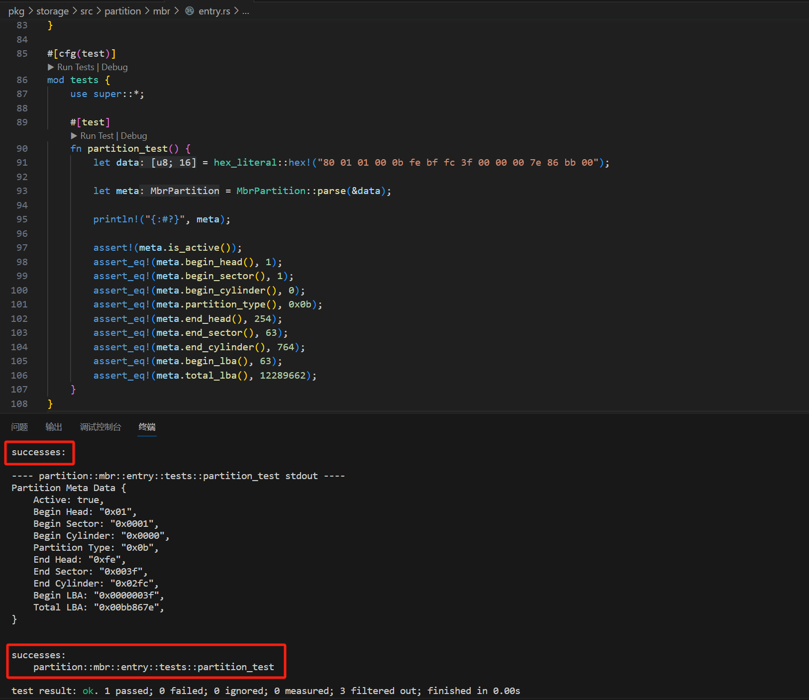
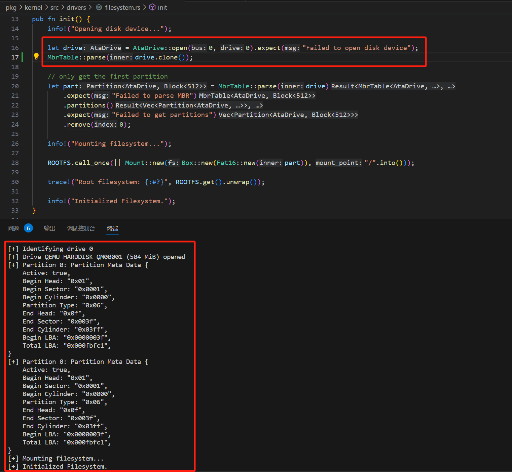
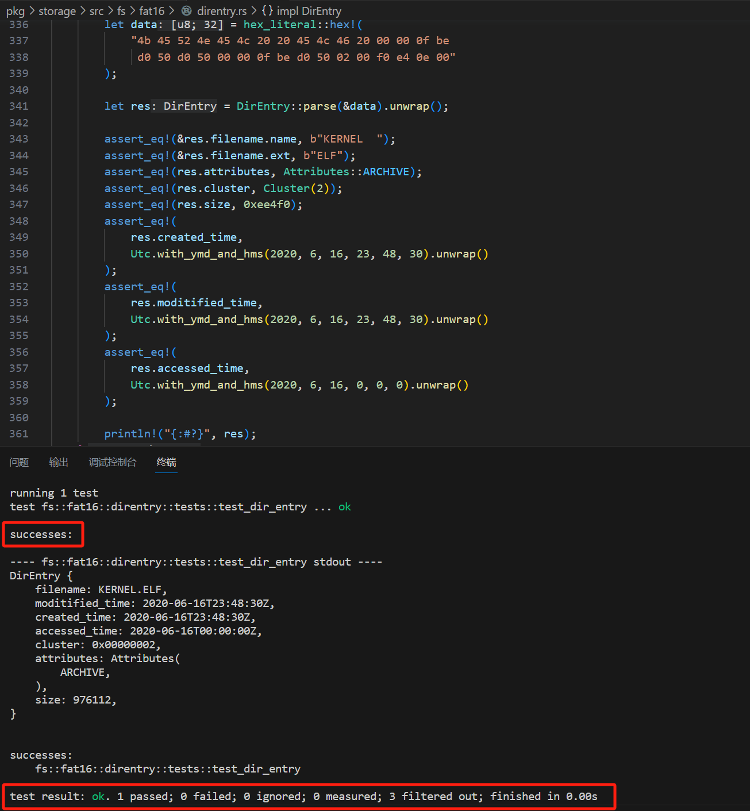
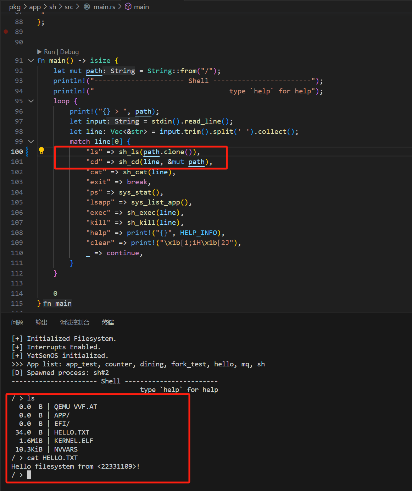

# Lab6 - 硬盘驱动与文件系统

## 代码说明

### MBR 分区表

在这部分的实验中，需要完成结构体 `MbrPartition`，并实现相应的解析和字段提取函数。

#### 结构体定义与解析

首先，我们定义了一个 `MbrPartition` 结构体，并实现了一个 `parse()`，用于从字节数组中提取分区表项：

```rust
impl MbrPartition {
    pub fn parse(data: &[u8; 16]) -> MbrPartition {
        MbrPartition {
            data: data.to_owned(),
        }
    }
}
```

该 `parse()` 接收一个 16 字节长的字节数组 `data`，并将其复制到 `MbrPartition` 结构体的 `data` 字段中。这个结构体将存储从 MBR（主引导记录）分区表中提取的数据。

#### 字段定义与提取

接着使用一个宏 `define_field!` 来简化字段提取函数的定义。宏的定义如下：

```rust
define_field!(u8, 0x00, status);
define_field!(u8, 0x01, begin_head);
define_field!(u8, 0x04, partition_type);
define_field!(u8, 0x05, end_head);
define_field!(u32, 0x08, begin_lba);
define_field!(u32, 0x0c, total_lba);
```

这个宏 `define_field!` 接受三个参数：字段的类型、字段在字节数组中的偏移量，以及字段的名称。根据这些参数，它会**自动生成**一个获取相应字段值的函数。

#### 字段解释与逻辑实现

**状态字段**

```rust
pub fn is_active(&self) -> bool {
    self.status() == 0x80
}
```

`is_active()` 函数用于检查分区是否是活动分区。它通过检查 `status` 字段的值是否为 `0x80` 来判断。

**CHS 地址解析**

CHS 地址包含开始和结束的磁头号、扇区号和柱面号。由于这些字段分布在字节数组的多个 bit 中，在这里需要手动解析它们。

```rust
pub fn begin_sector(&self) -> u8 {
    self.data[2] & 0x3f
}

pub fn begin_cylinder(&self) -> u16 {
    (self.data[2] as u16 & 0xc0) << 2 | (self.data[3] as u16)
}

pub fn end_sector(&self) -> u8 {
    self.data[6] & 0x3f
}

pub fn end_cylinder(&self) -> u16 {
    (self.data[6] as u16 & 0xc0) << 2 | (self.data[7] as u16)
}
```

**其余字段的解析**

1. `begin_sector()` 从 `data[2]` 字节中提取开始扇区号。通过 `& 0x3f` 操作，它获取低 6 位的值。
2. `begin_cylinder()` 通过将 `data[2]` 高 2 位和 `data[3]` 结合起来，计算开始柱面号。
3. `end_sector()` 和 `end_cylinder()` 函数类似地提取结束扇区号和柱面号。
4. `begin_head` 和 `end_head` 分别表示开始和结束的磁头号，使用 `define_field!` 宏定义并自动生成对应的函数。
5. `partition_type` 表示分区类型。
6. `begin_lba` 和 `total_lba` 分别表示分区的开始 LBA（逻辑块地址）和总 LBA 数。

这些字段的提取函数是通过 `define_field!` 宏自动生成的。

接着运行 YsOSv2 预先提供的测试函数，发现可以通过 MBR 的测试。 



### 磁盘驱动

在这部分的实验，需要我们实现对 ATA 磁盘驱动的识别和数据读写操作。

#### 写入命令

`write_command` 函数的作用是向 ATA 设备发送命令。

首先通过 `let mut bytes = block.to_le_bytes()` 将 `u32` 类型的块号转换为字节数组 `[u8; 4]`。接着我们将 LBA 地址的各个字节写入相应的寄存器，并设置驱动器号。同时将 ATA 命令写入命令寄存器。

```Rust
unsafe {
    self.sector_count.write(1);

    bytes[3].set_bit(4, drive > 0);
    bytes[3].set_bit(5, true);
    bytes[3].set_bit(6, true);
    bytes[3].set_bit(7, true);
    self.lba_low.write(bytes[0]);
    self.lba_mid.write(bytes[1]);
    self.lba_high.write(bytes[2]);
    self.drive.write(bytes[3]);
    self.command.write(cmd as u8);
}
```

如果状态寄存器为空，表示无法识别的设备，返回 `UnknownDevice` 错误。通过 `self.poll(AtaStatus::BUSY, false)` 轮询 ATA 状态寄存器，直到 `BUSY` 位清零。如果发生错误，记录警告信息，调用 `debug` 函数，并返回 `InvalidOperation` 错误。等到函数结束时再次轮询，确保 `BUSY` 位清零和 `DATA_REQUEST_READY` 位设置。

```Rust
fn write_command(&mut self, drive: u8, block: u32, cmd: AtaCommand) -> storage::Result<()> {
    let mut bytes = block.to_le_bytes(); // 将 u32 块号转换为 [u8; 4] 字节数组
    unsafe {
        self.sector_count.write(1); // 设置要操作的扇区数量为 1

        // 配置驱动器寄存器以启用 LBA28 模式
        bytes[3].set_bit(4, drive > 0); // 根据驱动器号设置第4位
        bytes[3].set_bit(5, true); // 设置第5位
        bytes[3].set_bit(6, true); // 设置第6位
        bytes[3].set_bit(7, true); // 设置第7位
        
        // 将 LBA 地址的各字节写入相应的寄存器
        self.lba_low.write(bytes[0]);
        self.lba_mid.write(bytes[1]);
        self.lba_high.write(bytes[2]);
        self.drive.write(bytes[3]);
        self.command.write(cmd as u8); // 将命令写入命令寄存器
    }

    if self.status().is_empty() {
        // 如果状态寄存器为空，表示未知的驱动器
        return Err(storage::DeviceError::UnknownDevice.into());
    }

    // 轮询直到 BUSY 状态位清零
    self.poll(AtaStatus::BUSY, false);

    if self.is_error() {
        // 如果发生错误，记录错误信息并返回错误
        warn!("ATA error: {:?} command error", cmd);
        self.debug();
        return Err(storage::DeviceError::InvalidOperation.into());
    }

    // 再次轮询直到 BUSY 状态位清零和 DATA_REQUEST_READY 状态位设置
    self.poll(AtaStatus::BUSY, false);
    self.poll(AtaStatus::DATA_REQUEST_READY, true);

    Ok(())
}
```

通过使用 `write_command()` 函数，我们能够向 ATA 设备发送命令。

#### 识别驱动器

`identify_drive()` 函数用于识别连接到总线上的驱动器。

首先，记录驱动器号。然后调用 `write_command()` 函数，传递驱动器号、块号 0 和 `AtaCommand::IdentifyDevice` 命令，如果命令发送失败且状态寄存器为空，则返回 `AtaDeviceType::None`；否则，返回一个未知设备错误。

接着轮询状态寄存器，直到 `BUSY` 位清零。最后，通过读取 `cylinder_low` 和 `cylinder_high` 的值来判断驱动器类型

- 如果是 `(0x00, 0x00)`，则返回 `AtaDeviceType::Pata`，并用 `read_data` 填充一个包含 256 个 `u16` 值的数组。
- 如果是 `(0x14, 0xEB)`，返回 `AtaDeviceType::PataPi`。
- 如果是 `(0x3C, 0xC3)`，返回 `AtaDeviceType::Sata`。
- 如果是 `(0x69, 0x96)`，返回 `AtaDeviceType::SataPi`。
- 否则，返回 `AtaDeviceType::None`。

```Rust
    pub(super) fn identify_drive(&mut self, drive: u8) -> storage::Result<AtaDeviceType> {
        info!("Identifying drive {}", drive);

        if self.write_command(drive, 0, AtaCommand::IdentifyDevice).is_err() {
            if self.status() == AtaStatus::empty() {
                return Ok(AtaDeviceType::None);
            } else {
                return Err(FsError::from(DeviceError::Unknown));
            }
        }

        self.poll(AtaStatus::BUSY, false);

        Ok(match (self.cylinder_low(), self.cylinder_high()) {
            (0x00, 0x00) => AtaDeviceType::Pata(Box::new([0u16; 256].map(|_| self.read_data()))),
            (0x14, 0xEB) => AtaDeviceType::PataPi,
            (0x3C, 0xC3) => AtaDeviceType::Sata,
            (0x69, 0x96) => AtaDeviceType::SataPi,
            _ => AtaDeviceType::None,
        })
    }
```

#### 读取数据

`read_pio` 函数用于从指定的驱动器和块号读取数据到缓冲区中。

首先依旧调用 `write_command()` 函数，传递驱动器号、块号和 `AtaCommand::ReadPio` 命令以发送读命令。

如果发送成功，则使用 `buf.chunks_mut(2)` 将缓冲区分成按2字节为一组的切片。对于每个切片，调用 `read_data` 函数读取一个 `u16` 类型的数据，并转换为小端字节数组，然后将该字节数组复制到缓冲区的当前切片。

如果在读取过程中检测到错误，记录调试信息并调用 `debug` 函数，然后返回 `ReadError`。否则，返回 `Ok(())` 表示读取成功。

```rust
    pub(super) fn read_pio(
        &mut self,
        drive: u8,
        block: u32,
        buf: &mut [u8],
    ) -> storage::Result<()> {
        self.write_command(drive, block, AtaCommand::ReadPio)?;

        for chunk in buf.chunks_mut(2) {
            let data = self.read_data().to_le_bytes();
            chunk.clone_from_slice(&data);
        }
        if self.is_error() {
            debug!("ATA error: data read error");
            self.debug();
            Err(storage::DeviceError::ReadError.into())
        } else {
            Ok(())
        }
    }
```

#### 写入数据

`write_pio` 函数用于将数据写入指定的驱动器和块号。

首先依旧调用 `write_command` 函数，传递驱动器号、块号和 `AtaCommand::WritePio` 命令以发送写命令。

如果命令发送成功，则使用 `buf.chunks(2)` 将缓冲区分成按2字节为一组的切片。对于每个切片，调用 `u16::from_le_bytes` 将切片转换为一个 `u16` 类型的数据，然后调用 `write_data` 函数将该数据写入设备。

如果在写入过程中检测到错误，记录调试信息并调用 `debug` 函数，然后返回 `WriteError`。否则，返回 `Ok(())` 表示写入成功。

```Rust
    pub(super) fn write_pio(&mut self, drive: u8, block: u32, buf: &[u8]) -> storage::Result<()> {
        self.write_command(drive, block, AtaCommand::WritePio)?;

        for chunk in buf.chunks(2) {
            let data = u16::from_le_bytes(chunk.try_into().unwrap());
            self.write_data(data);
        }
        if self.is_error() {
            debug!("ATA error: data write error");
            self.debug();
            Err(storage::DeviceError::WriteError.into())
        } else {
            Ok(())
        }
    }
```

通过上述实现，我们完成了对 ATA 驱动器的识别和数据读写操作。`write_command()` 函数负责向驱动器发送命令，`identify_drive()` 函数识别驱动器类型，`read_pio()` 函数读取数据到缓冲区，而 `write_pio()` 函数将缓冲区中的数据写入驱动器。这些功能共同实现了对 ATA 驱动器的基本操作。

接下来我在 `filesystem::init()` 函数执行时添加运行 `MbrTable::parse(drive.clone())`，发现可以实现对磁盘的识别与解析。



### FAT16 文件系统

#### BPB

与 MBR 字段的分析类似，`define_field!` 宏定义了 BPB 中的各个字段，指定字段类型和偏移量，自动生成相应的访问器方法。字段定义包括 OEM 名称、每扇区字节数、每簇扇区数、保留扇区数、FAT 数量、根目录条目数量、16 位和 32 位总扇区数、媒体描述符、每 FAT 扇区数、每道扇区数、隐藏扇区数、驱动器号、保留标志、启动签名、卷 ID、卷标签和系统标识符等。

通过这些字段和方法，可以访问并解析 FAT16 BPB 结构中的各种信息，实现文件系统的进一步处理。

```Rust
impl Fat16Bpb {
    /// Attempt to parse a Boot Parameter Block from a 512 byte sector.
    pub fn new(data: &[u8]) -> Result<Fat16Bpb, &'static str> {
        let data = data.try_into().unwrap();
        let bpb = Fat16Bpb { data };

        if bpb.data.len() != 512 || bpb.trail() != 0xAA55 {
            return Err("Bad BPB format");
        }

        Ok(bpb)
    }

    pub fn total_sectors(&self) -> u32 {
        if self.total_sectors_16() == 0 {
            self.total_sectors_32()
        } else {
            self.total_sectors_16() as u32
        }
    }

    // define all the fields in the BPB
    //      - use `define_field!` macro
    //      - ensure you can pass the tests
    //      - you may change the field names if you want
    define_field!([u8; 8], 0x03, oem_name);
    define_field!(u16, 0x0b, bytes_per_sector);
    define_field!(u8, 0x0d, sectors_per_cluster);
    define_field!(u16, 0x0e, reserved_sector_count);
    define_field!(u8, 0x10, fat_count);
    define_field!(u16, 0x11, root_entries_count);
    define_field!(u16, 0x13, total_sectors_16);
    define_field!(u8, 0x15, media_descriptor);
    define_field!(u16, 0x16, sectors_per_fat);
    define_field!(u16, 0x18, sectors_per_track);
    define_field!(u16, 0x1a, track_count);
    define_field!(u32, 0x1c, hidden_sectors);
    define_field!(u32, 0x20, total_sectors_32);
    define_field!(u8, 0x24, drive_number);
    define_field!(u8, 0x25, reserved_flags);
    define_field!(u8, 0x26, boot_signature);
    define_field!(u32, 0x27, volume_id);
    define_field!([u8; 11], 0x2b, volume_label);
    define_field!([u8; 8], 0x36, system_identifier);
    define_field!(u16, 0x1fe, trail);
}
```

#### DirEntry

`DirEntry` 的 `LEN` 常量定义了目录项的长度为 32 字节 (`0x20`)，符合 FAT16 文件系统中的规范。

`parse()` 函数接受一个字节切片 (`&[u8]`) 并将其解析为 `DirEntry` 结构体。使用 `ShortFileName::new` 函数解析前 11 个字节，并将其转换为 `ShortFileName` 类型。`attributes` 字段通过解析第 11 个字节来确定文件属性。`created_time` 字段通过将第 14-17 字节解析为小端 32 位整数，并调用 `prase_datetime` 函数转换为时间格式。`accessed_time` 字段通过解析第 18-19 字节并调用 `prase_datetime` 函数来获取访问时间。`cluster` 字段通过解析第 20-21 和 26-27 字节，并将其组合为 32 位整数来表示文件起始簇号。`moditified_time` 字段通过将第 22-25 字节解析为小端 32 位整数，并调用 `prase_datetime` 函数转换为修改时间。`size` 字段通过解析第 28-31 字节，并将其转换为小端 32 位整数表示文件大小。

最后返回一个 `DirEntry` 实例，包含文件名、创建时间、访问时间、修改时间、起始簇号、文件属性和文件大小等信息。

```Rust
impl DirEntry {
    pub const LEN: usize = 0x20;

    /// For Standard 8.3 format
    ///
    /// reference: https://osdev.org/FAT#Standard_8.3_format
    pub fn parse(data: &[u8]) -> Result<DirEntry> {
        let filename = ShortFileName::new(&data[..11]);

        //  parse the rest of the fields
        //      - ensure you can pass the test
        //      - you may need `prase_datetime` function
        let attributes = Attributes::from_bits_truncate(data[11]);
        let mut time = u32::from_le_bytes([data[14], data[15], data[16], data[17]]);
        let created_time = prase_datetime(time);
        time = u32::from_le_bytes([0, 0, data[18], data[19]]);
        let accessed_time = prase_datetime(time);
        let cluster = (data[27] as u32) << 8
            | (data[26] as u32)
            | (data[21] as u32) << 24
            | (data[20] as u32) << 16;
        time = u32::from_le_bytes([data[22], data[23], data[24], data[25]]);
        let moditified_time = prase_datetime(time);
        let size = u32::from_le_bytes([data[28], data[29], data[30], data[31]]);

        Ok(DirEntry {
            filename,
            moditified_time,
            created_time,
            accessed_time,
            cluster: Cluster(cluster),
            attributes,
            size,
        })
    }

    pub fn as_meta(&self) -> Metadata {
        self.into()
    }
}
```

运行 `cargo test`，发现可以通过正确性测试



#### Fat16Impl

在实现了上述文件系统的数据格式之后，接下来我们需要在 `fs/fat16/impls.rs` 文件中实现一系列关键函数。这些函数将进一步完善 FAT16 文件系统的功能，使其能够在实际应用中有效运行。

以下是我将要实现的几个重要函数，它们将涵盖文件的读取、写入、删除和管理等操作。

- `new()`：用于初始化 FAT16 文件系统的实例。
- `get_directory_iter()`：用于遍历指定目录中的所有有效目录项。
- `get_directory_entry()`：用于在指定目录中查找特定名称的目录项。
- `get_next_cluster()`：获取指定簇号的下一个簇号。
- `get_sector_entry()`：在指定扇区内查找匹配的目录项。
- `get_parent_dir()`：获取给定路径的父目录。
- `read_dir()`：读取给定路径下的目录内容。
- `open_file()`：

**new()**

`Fat16Impl` 的 `new` 函数，用于初始化一个新的 FAT16 文件系统实例。该函数接受一个实现了 `BlockDevice<Block512>` 的参数 `inner`。

首先，创建一个默认的块 `block` 并读取块设备的第一个块（MBR）。然后，通过 `Fat16Bpb::new` 函数解析读取的块以获取 FAT16 的 BPB（BIOS Parameter Block）。接着计算根目录大小、FAT 表开始的扇区、根目录开始的扇区以及数据开始的扇区。

最后，返回一个包含 BPB、块设备、FAT 表开始扇区、数据开始扇区和根目录开始扇区的 `Fat16Impl` 实例。

```Rust
impl Fat16Impl {
    pub fn new(inner: impl BlockDevice<Block512>) -> Self {
        let mut block = Block::default();
        let _block_size = Block512::size();

        inner.read_block(0, &mut block).unwrap();
        let bpb = Fat16Bpb::new(block.as_ref()).unwrap();

        trace!("Loading Fat16 Volume: {:#?}", bpb);

        // HINT: FirstDataSector = BPB_ResvdSecCnt + (BPB_NumFATs * FATSz) + RootDirSectors;
        let root_dir_size = ((bpb.root_entries_count() as usize * DirEntry::LEN) + BLOCK_SIZE - 1) / BLOCK_SIZE;
        let fat_start = bpb.reserved_sector_count() as usize;
        let first_root_dir_sector = fat_start + (bpb.fat_count() as usize * bpb.sectors_per_fat() as usize);
        let first_data_sector = first_root_dir_sector + root_dir_size;

        Self {
            bpb,
            inner: Box::new(inner),
            fat_start,
            first_data_sector,
            first_root_dir_sector,
        }
    }
}
```

**get_directory_iter()**

`Fat16Impl` 的 `get_directory_iter` 函数，用于遍历指定目录中的所有有效目录项。该函数接受一个目录引用 `dir` 和一个函数 `func`，并调用 `func` 来处理每个有效的目录项。

首先，函数通过 `trace!` 宏记录目录名（如果有）。然后，它计算出当前目录的簇号、起始扇区号和目录大小。如果目录是根目录，则计算其大小，否则计算其簇所包含的扇区数。接着，函数读取当前簇中的所有扇区并解析每个目录项。对于每个目录项，如果是有效的短文件名目录项，则调用 `func` 函数处理该目录项。如果遇到目录结束标志（EOD），则终止遍历。若当前簇不是根目录且有后续簇，则获取下一个簇并继续遍历。

最后返回 `Ok(())` 表示成功完成遍历。

```Rust
impl Fat16Impl {
    pub fn get_directory_iter<F>(&self, dir: &Directory, mut func: F) -> Result<()>
    where
        F: FnMut(&DirEntry),
    {
        if let Some(entry) = &dir.entry {
            trace!("Iterating directory: {}", entry.filename());
        }

        let mut current_cluster = Some(dir.cluster);
        let mut dir_sector_num = self.cluster2sector(&dir.cluster);
        let dir_size = match dir.cluster {
            Cluster::ROOT_DIR => self.first_data_sector - self.first_root_dir_sector,
            _ => self.bpb.sectors_per_cluster() as usize,
        };
        trace!("Directory size: {}", dir_size);

        let mut block = Block::default();
        while let Some(cluster) = current_cluster {
            for sector in dir_sector_num..dir_sector_num + dir_size {
                self.inner.read_block(sector, &mut block).unwrap();
                for entry in 0..BLOCK_SIZE / DirEntry::LEN {
                    let start = entry * DirEntry::LEN;
                    let end = (entry + 1) * DirEntry::LEN;

                    let dir_entry =
                        DirEntry::parse(&block[start..end])?;

                    if dir_entry.is_eod() {
                        return Ok(());
                    } else if dir_entry.is_valid() && !dir_entry.is_long_name() {
                        func(&dir_entry);
                    }
                }
            }
            current_cluster = if cluster != Cluster::ROOT_DIR {
                match self.get_next_cluster(cluster) {
                    Ok(n) => {
                        dir_sector_num = self.cluster2sector(&n);
                        Some(n)
                    }
                    _ => None,
                }
            } else {
                None
            }
        }
        Ok(())
    }
}
```

**get_directory_entry()**

`Fat16Impl` 的 `get_directory_entry` 函数，用于在指定目录中查找特定名称的目录项。函数接受一个目录引用 `dir` 和一个字符串 `name`，并返回一个匹配的 `DirEntry` 实例。

首先，将给定的名称解析为 `ShortFileName` 格式的 `match_name`。然后，函数初始化当前簇号 `current_cluster` 和目录起始扇区号 `dir_sector_num`。根据目录簇号，计算目录的大小。如果目录是根目录，计算根目录的大小，否则计算每个簇的扇区数。接下来，遍历当前簇中的所有扇区，并在每个扇区中调用 `get_sector_entry` 函数来查找与 `match_name` 匹配的目录项。

如果找到匹配的目录项，则返回该目录项；如果在当前扇区未找到匹配项，继续检查下一个扇区。如果当前簇不是根目录且有后续簇，则获取下一个簇并继续遍历。如果遍历完所有簇后仍未找到匹配的目录项，则返回 `FsError::FileNotFound` 错误。

```Rust
impl Fat16Impl {
    pub fn get_directory_entry(
        &self,
        dir: &Directory,
        name: &str,
    ) -> Result<DirEntry> {
        let match_name = ShortFileName::parse(name)?;

        let mut current_cluster = Some(dir.cluster);
        let mut dir_sector_num = self.cluster2sector(&dir.cluster);
        let dir_size = match dir.cluster {
            Cluster::ROOT_DIR => self.first_data_sector - self.first_root_dir_sector,
            _ => self.bpb.sectors_per_cluster() as usize,
        };
        while let Some(cluster) = current_cluster {
            for sector in dir_sector_num..dir_sector_num + dir_size {
                match self.get_sector_entry(&match_name, sector) {
                    Err(FsError::NotInSector) => continue,
                    x => return x,
                }
            }
            current_cluster = if cluster != Cluster::ROOT_DIR {
                match self.get_next_cluster(cluster) {
                    Ok(n) => {
                        dir_sector_num = self.cluster2sector(&n);
                        Some(n)
                    }
                    _ => None,
                }
            } else {
                None
            }
        }
        Err(FsError::FileNotFound)
    }
}
```

**get_next_cluster()**

`Fat16Impl` 的 `get_next_cluster` 函数，该函数用于获取指定簇号的下一个簇号。

首先，计算 FAT 表中当前簇号的偏移量 `fat_offset`，然后确定当前簇号所在的 FAT 扇区 `cur_fat_sector` 及其在扇区内的偏移 `offset`。接着，读取 FAT 扇区的数据并将其存储在 `block` 中。使用 `offset` 从 `block` 中提取两个字节的数据，并将其解析为 `fat_entry`。

根据 `fat_entry` 的值，函数返回不同的结果：如果 `fat_entry` 为 0xFFF7，则表示这是一个坏簇，返回 `FsError::BadCluster` 错误；如果 `fat_entry` 在 0xFFF8 到 0xFFFF 之间，则表示没有下一个簇，返回 `FsError::EndOfFile` 错误；否则，将 `fat_entry` 转换为 `Cluster` 类型并返回，表示这是一个有效的下一个簇。

```Rust
impl Fat16Impl {
    pub fn get_next_cluster(&self, cluster: Cluster) -> Result<Cluster> {
        let fat_offset = (cluster.0 * 2) as usize;
        let cur_fat_sector = self.fat_start + fat_offset / BLOCK_SIZE;
        let offset = fat_offset % BLOCK_SIZE;

        let mut block = Block::default();
        self.inner.read_block(cur_fat_sector, &mut block).unwrap();

        let fat_entry = u16::from_le_bytes(block[offset..=offset + 1].try_into().unwrap_or([0; 2]));
        match fat_entry {
            0xFFF7 => Err(FsError::BadCluster),
            0xFFF8..=0xFFFF => Err(FsError::EndOfFile),
            f => Ok(Cluster(f as u32))
        }
    }
}
```

**get_sector_entry()**

`Fat16Impl` 的 `get_sector_entry` 函数，该函数用于在指定扇区内查找与 `match_name` 匹配的目录项。

首先，函数创建一个默认的 `block`，并将指定扇区的数据读取到 `block` 中。然后，循环遍历扇区中的每个目录项，每个目录项的长度为 `DirEntry::LEN` 字节。对于每个目录项，解析其数据并创建 `DirEntry` 实例。如果解析失败，则返回 `FsError::InvalidOperation` 错误。

接着，检查目录项是否为目录结束标记（EOD），如果是则提前返回 `FsError::FileNotFound` 错误。否则，检查目录项的文件名是否匹配 `match_name`，如果匹配则返回该目录项。若遍历完所有目录项仍未找到匹配项，则返回 `FsError::NotInSector` 错误。

```Rust
impl Fat16Impl {
    fn get_sector_entry(
        &self,
        match_name: &ShortFileName,
        sector: usize,
    ) -> Result<DirEntry> {
        let mut block = Block::default();
        self.inner.read_block(sector, &mut block).unwrap();

        for entry in 0..BLOCK_SIZE / DirEntry::LEN {
            let start = entry * DirEntry::LEN;
            let end = (entry + 1) * DirEntry::LEN;
            let dir_entry =
                DirEntry::parse(&block[start..end]).map_err(|_| FsError::InvalidOperation)?;
            // trace!("Matching {} to {}...", dir_entry.filename(), match_name);
            if dir_entry.is_eod() {
                // Can quit early
                return Err(FsError::FileNotFound);
            } else if dir_entry.filename.matches(match_name) {
                // Found it
                return Ok(dir_entry);
            };
        }
        Err(FsError::NotInSector)
    }
}
```

**get_parent_dir()**

`Fat16Impl` 的 `get_parent_dir` 函数，该函数用于获取给定路径的父目录。

首先，将路径按路径分隔符拆分为多个部分，并初始化当前目录为根目录。然后，遍历路径的每一部分，跳过空部分。

如果当前部分对应的目录项是目录，则更新当前目录为该目录项对应的目录。如果当前部分不是目录且路径中还有其他部分，则返回 `FsError::NotADirectory` 错误，否则结束循环。最终返回当前目录作为结果。

```Rust
impl Fat16Impl {
    fn get_parent_dir(&self, path: &str) -> Result<Directory> {
        let mut path = path.split(PATH_SEPARATOR);
        let mut current = Directory::root();

        while let Some(dir) = path.next() {
            if dir.is_empty() {
                continue;
            }

            let entry = self.get_directory_entry(&current, dir)?;

            if entry.is_directory() {
                current = Directory::from_entry(entry);
            } else if path.next().is_some() {
                return Err(FsError::NotADirectory);
            } else {
                break;
            }
        }

        Ok(current)
    }
}
```

**read_dir()**

`FileSystem` trait 的 `read_dir` 方法，用于读取给定路径下的目录内容，并返回一个包含所有目录项元数据的迭代器。

首先，通过 `get_parent_dir` 函数获取给定路径的父目录。然后，初始化一个空的 `entries` 向量，并调用 `get_directory_iter` 函数遍历目录中的所有项，将每个项的元数据通过 `as_meta` 方法转换后存储在 `entries` 向量中。最后，将 `entries` 向量转换为迭代器并封装在 `Box` 中返回。

```Rust
impl FileSystem for Fat16 {
    fn read_dir(&self, path: &str) -> Result<Box<dyn Iterator<Item = Metadata> + Send>> {
        // read dir and return an iterator for all entries
        let dir = self.handle.get_parent_dir(path)?;
        let mut entries = Vec::new();

        self.handle.get_directory_iter(&dir, |entry| {
            entries.push(entry.as_meta());
        })?;

        Ok(Box::new(entries.into_iter()))
    }
}
```

**open_file()**

`FileSystem` trait 的 `open_file` 方法，用于打开指定路径的文件并返回一个文件句柄。

首先，通过 `get_dir_entry` 函数获取路径对应的目录项。如果目录项是一个目录，则返回 `FsError::NotAFile` 错误。接着，克隆文件系统的句柄，并获取目录项的元数据。创建一个新的 `File` 实例并封装在 `Box` 中。最后，使用元数据和文件实例创建一个 `FileHandle`，并将其返回。

```Rust
impl FileSystem for Fat16 {
    fn open_file(&self, path: &str) -> Result<FileHandle> {
        // open file and return a file handle
        let entry = self.handle.get_dir_entry(path)?;

        if entry.is_directory() {
            return Err(FsError::NotAFile);
        }

        let handle = self.handle.clone();
        let meta = entry.as_meta();
        let file = Box::new(File::new(handle, entry));

        let file_handle = FileHandle::new(meta, file);

        Ok(file_handle)
    }
}
```

### 接入操作系统

接下来我们实现两个内联函数 `sys_open` 和 `sys_close`，用于文件的系统调用操作。

`sys_open` 函数接受一个文件路径字符串作为参数，并通过 `syscall!` 宏发起 `Syscall::Open` 系统调用，将路径指针和路径长度作为参数传递，返回文件描述符。

`sys_close` 函数接受一个文件描述符作为参数，通过 `syscall!` 宏发起 `Syscall::Close` 系统调用，将文件描述符作为参数传递，返回值指示关闭操作是否成功。

```Rust
#[inline(always)]
pub fn sys_open(path: &str) -> u8 {
    syscall!(
        Syscall::Open,
        path.as_ptr() as u64,
        path.len() as u64
    ) as u8
}

#[inline(always)]
pub fn sys_close(fd: u8) -> bool {
    syscall!(Syscall::Close, fd as u64) != 0
}
```

最后我们在 `Shell` 实现两个函数 `sh_cat` 和 `sh_ls`，分别用于显示文件内容和列出目录内容。

`sh_cat` 函数接受一个字符串向量 `line` 作为参数，打开指定路径的文件，读取文件内容到缓冲区，并将其逐字符打印到控制台，最后关闭文件。

`sh_ls` 函数接受一个路径字符串 `path` 作为参数，通过 `sys_list_dir` 系统调用列出目录内容。

```Rust
pub fn sh_cat(line : Vec<&str>) {
    let file_path = line[1];
    let file = sys_open(file_path);
    let mut buf = vec![0; 0x1000];
    let size = sys_read(file, &mut buf).unwrap();
    for ch in  buf.iter() {
        print!("{}", *ch as char)
    }
    sys_close(file);
    return;
}

pub fn sh_ls(path : String) {
    sys_list_dir(path.as_str());
    return;
}
```

可以得到读取文件的输出。



## 思考任务

1. **为什么在 pkg/storage/lib.rs 中声明了 #![cfg_attr(not(test), no_std)]，它有什么作用？哪些因素导致了 kernel 中进行单元测试是一个相对困难的事情？**

`cfg_attr(not(test), no_std)` 意思是：当编译配置中没有启用 `test` 特性时，应用 `no_std` 属性。`no_std` 属性用于禁用 Rust 标准库，这是在嵌入式系统或操作系统内核开发中常见的做法，因为这些环境通常没有标准库的支持。

`kernel` 的运行需要在 `no_std` 环境下运行，但是单元测试的运行需要 `no_std` 环境。

2. **留意 MbrTable 的类型声明，为什么需要泛型参数 T 满足 `BlockDevice<B>` + Clone？为什么需要 `PhantomData<B>` 作为 MbrTable 的成员？在 PartitionTable trait 中，为什么需要 Self: Sized 约束？**

`BlockDevice<B>` 是一个 `trait`，表示块设备。意味着 `MbrTable` 可以操作任何实现了 `BlockDevice<B>` 的设备，而不局限于某种具体类型的设备。这提供了极大的灵活性和抽象能力。实现 `Clone trait` 是为了能够在 `MbrTable` 内部或其他地方复制设备实例。克隆能力在很多场景中是必要的，比如在多线程环境中，需要复制设备句柄来进行并行操作。

`PhantomData<B>` 是一个零大小类型，它不会占用实际的存储空间，但可以在类型系统中起到标记作用。为了避免编译器认为 `B` 没有用到而发出警告，我们使用 `PhantomData<B>` 来告诉编译器这个泛型参数是有用的。

`Self:Sized` 约束意味着实现 `PartitionTable trait` 的类型必须是有已知大小的。这样才能在栈上分配空间并安全地返回。在泛型函数中，如果没有 `Self:Sized` 约束，很多操作是无法进行的。它确保了这个 `trait` 不能被用于动态分发。这对于某些设计模式来说是必要的，特别是在编写操作系统的场景中。

3. **AtaDrive 为了实现 MbrTable，如何保证了自身可以实现 Clone？对于分离 AtaBus 和 AtaDrive 的实现，你认为这样的设计有什么好处？**

使用  `#[derive(Clone)]` 标识符来标记自身可以被 `clone`，且结构体内成员均是可以正常执行 `clone` 的类型。

这样设计的好处有：

**模块抽象**：职责分离使得代码更加模块化，每个模块只需要关心自己的功能。通过这种抽象，代码更容易理解和维护。
**便于并发**：使用 Arc<Mutex<AtaBus>> 允许多个 AtaDrive 实例共享一个 AtaBus 实例，并且可以安全地进行并发操作。
**便于测试**：可以单独测试 AtaBus 和 AtaDrive 的功能，而不需要它们总是捆绑在一起。
**增加复用**：如果以后需要支持不同类型的总线，可以重用 AtaDrive 的实现。

4. **结合本次实验中的抽象和代码框架，简单解释和讨论如下写法的异同：**

```Rust
// 函数声明：
fn f<T: Foo>(f: T) -> usize
fn f(f: impl Foo) -> usize
fn f(f: &dyn Foo) -> usize

// 结构体声明：
struct S<T: Foo> { f: T }
struct S { f: Box<dyn Foo> }
```

`fn f<T: Foo>(f: T) -> usize`：泛型参数方式，编译期确定类型，性能最佳，适用于单一具体实现。
`fn f(f: impl Foo) -> usize`：与泛型类似的语法糖，简化函数签名，同样在编译期确定类型。
`fn f(f: &dyn Foo) -> usize`：使用动态分发，通过引用传递，运行时确定类型，灵活性更高，但有性能开销。
`struct S<T: Foo> { f: T }`：泛型结构体，编译期确定类型，适用于单一具体实现，内存布局固定。
`struct S { f: Box<dyn Foo> }`：结构体内包含动态分发的 Box，适用于不同类型的 Foo 实现，灵活性高，但有性能开销。

5. **文件系统硬链接和软链接的区别是什么？Windows 中的 “快捷方式” 和 Linux 中的软链接有什么异同？**

两者都指向目标文件或目录，并且用户可以通过它们访问目标。两者都是独立的文件，包含指向目标的路径。

| / | Linux | Windows |
| --- | --- | --- |
| 操作系统行为 | 系统将软链接视为实际文件或目录的一部分 | 资源管理器会解析快捷方式。命令行操作需要通过特定工具解析 |
| 实现方式 | 是文件系统级别的实现 | 是一个特殊的文件，跳转方式 |
| 作用范围 | 可以在命令行和所有程序中使用 | 主要用于图形界面，命令行工具需要特定支持 |

6. **日志文件系统（如 NTFS）与传统的非日志文件系统（如 FAT）在设计和实现上有哪些不同？在系统异常崩溃后，它的恢复机制、恢复速度有什么区别？**

NTFS 使用一种称为日志文件的结构来记录文件系统元数据的更改。每当文件系统的元数据发生变化时，系统会首先在日志中记录下这些变化。这确保了即使在系统崩溃时，文件系统也可以恢复到一致的状态。

| 特性 | NTFS | FAT |
|---|---|---|
| **日志机制** | 记录元数据更改的日志文件，确保系统崩溃时数据一致性 | 无日志机制，依赖检查磁盘工具进行恢复 |
| **数据结构** | 使用 B 树和主文件表管理文件和目录 | 使用简单的链表结构（FAT 表）管理文件和目录 |
| **安全性和权限** | 支持访问控制列表（ACL）| 不支持复杂的权限管理 |
| **文件系统特性** | 支持大文件和大容量存储，提供文件压缩和加密功能 | 文件大小限制为 4GB，分区最大为 32GB |
| **恢复机制** | 使用日志回放恢复未完成的操作 | 依赖检查磁盘（chkdsk）工具扫描和修复文件系统 |
| **恢复速度** | 快速恢复，通常在几秒钟内完成 | 恢复速度较慢，尤其在大容量分区或大量文件情况下 |

## 加分项

**探索 Linux 文件系统**

1. **procfs**

在 /proc 中，你可以找到一系列的文件和文件夹，探索他们并回答如下问题：

问：解释 /proc 下的数字目录代表什么，其内部存在什么内容？
答：数字代表进程 pid，内部是进程信息。

问：/proc/cpuinfo 和 /proc/meminfo 存储了哪些信息？
答：当前系统的 CPU 占用和内存占用信息。

问：/proc/loadavg 和 /proc/uptime 存储了哪些信息？
答：系统的平均负载信息和自上次启动以来的运行时间和空闲时间。

问：尝试读取 /proc/interrupts 文件，你能够从中获取到什么信息？
答：提供了关于系统中每个中断源的详细信息，包括中断处理器、每个中断的计数器以及与每个中断相关的设备。

问：尝试读取 /proc/self/status 文件，你能够从中获取到什么信息？
答：提供了有关当前进程的各种状态信息。这个文件对于了解进程的运行时情况和系统资源使用情况非常有用。

问：尝试读取 /proc/self/smaps 文件，你能够从中获取到什么信息？
答：提供了详细的关于进程内存使用的信息，包括每个内存映射区域的详细统计数据。

问：结合搜索，回答 echo 1 > /proc/sys/net/ipv4/ip_forward 有什么用？尝试据此命令，从系统调用角度，解释 “一切皆文件” 的优势。
答：用于在 Linux 系统上启用 IP 转发功能。

2. **devfs**

Linux 将设备也作为 “文件”，默认挂载于 /dev 目录下，探索他们并回答如下问题：

问：/dev/null、/dev/zero、/dev/random 和 /dev/urandom 分别有什么作用？
答：/dev/null 用于丢弃数据；/dev/zero 提供无限的零字节流；/dev/random 和 /dev/urandom 提供随机数据流，其中前者更安全但可能阻塞，后者更快但不如前者安全。

问：尝试运行 head /dev/kmsg 并观察输出，结合搜索引擎，解释这一文件的作用。
答：/dev/kmsg 提供了内核消息日志的实时输出，通常由系统日志守护进程读取以记录系统事件和错误信息。

问：/dev/sdX 和 /dev/sdX1 （X 为一个字母，1 为数字）是什么？有什么区别？如果你正在使用的 Linux 系统中不存在这样的文件，请找到功能类似的文件，并解释。
答：/dev/sdX 是硬盘或存储设备，/dev/sdX1 是该设备的第一个分区。它们区别在于一个表示整个设备，另一个表示设备的一个分区。如果不存在，可以找到类似的 /dev/nvmeXnY 和 /dev/nvmeXnYp1，分别对应 NVMe 设备和其分区。

问：/dev/ttyX、/dev/loopX、/dev/srX 分别代表什么设备？
答：/dev/ttyX 是虚拟终端设备；/dev/loopX 是回环设备，用于创建虚拟块设备；/dev/srX 是光驱设备，用于读取光盘或 DVD。

问：列出 /dev/disk 下的目录，尝试列出其中的“软连接”，这样的设计有什么好处？
答：软连接可以提供设备的别名，简化访问路径或管理。例如，/dev/disk/by-id/ 包含设备 ID 的软连接，方便识别和持久化设备连接。

问：尝试运行 lsblk 命令，根据你的输出，解释其中的内容。
答：lsblk 列出块设备的信息，包括设备名称、大小、挂载点和分区结构。

3. **tmpfs**

在 Linux 中 /dev/shm、/run 或者 /var/run 目录下，存储了一个特殊的文件系统，它是一个内存文件系统，探索它并回答如下问题：

问：列出这些目录，尝试找到扩展名为 pid 的文件。应用程序如何利用它们确保某个程序只运行一个实例？
答：通过列出如 /var/run、/run 或 /tmp 这些目录，可以找到扩展名为 .pid 的文件。应用程序通常在启动时将自己的进程 ID 写入该文件，其他实例启动时会检查该文件是否存在，以避免多个实例运行。

问：列出这些目录，尝试找到扩展名为 lock 的文件。应用程序如何利用它们确保某个资源只被一个程序访问？
答：在目录如 /var/lock 或 /run/lock 中可以找到扩展名为 .lock 的文件。应用程序通常在访问共享资源之前，尝试获取这些文件的锁，如果锁已被其他程序持有，则等待或放弃访问。

问：列出这些目录，尝试找到扩展名为 sock 或 socket 的文件。应用程序如何利用它们实现进程间通信？
答：在 /var/run、/run 或 /tmp 目录中可以找到扩展名为 .sock 或 .socket 的文件。应用程序可以通过这些 UNIX 域套接字文件来进行进程间通信，实现数据传输和协调操作。

问：tmpfs 的存在对于操作系统有什么作用？尝试从性能、安全性、系统稳定性几方面进行回答。
答：tmpfs 是一种基于内存的文件系统，提供了快速的读写速度，不会在系统重启时保留数据，

4. **在完全手动安装一个 Linux 操作系统时，我们常常会将待安装的磁盘（分区）格式化后，使用 mount 挂载于 /mnt 目录下。之后，可以使用 chroot 切换根目录，在“新的操作系统”中进行安装后期的工作。**

`mount proc /mnt/proc -t proc -o nosuid,noexec,nodev`：将 `/proc` 文件系统挂载到 `/mnt/proc` 目录下。

`mount sys /mnt/sys -t sysfs -o nosuid,noexec,nodev,ro`：将 `/sys` 文件系统挂载到 `/mnt/sys` 目录下。

`mount udev /mnt/dev -t devtmpfs -o mode=0755,nosuid`：将 `udev` 文件系统挂载到 `/mnt/dev` 目录下。

**为什么需要这些挂载操作？**

- 确保新的根文件系统能够访问到关键的系统信息和设备管理功能。
- 如果不进行这些挂载操作，新的根文件系统可能无法获取到必要的系统信息，导致系统管理和配置功能受限或失效。
- Linux 系统的操作需要依赖于 `/proc`、`/sys` 和 `udev` 等文件系统来获取运行时信息和管理系统资源。